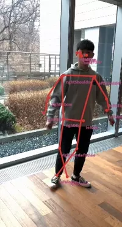

# NNStreamer Examples

This repository shows developers how to create their applications with nnstreamer/gstreamer. We recommend to install nnstreamer by downloading prebuilt binary packages from Launchpad/PPA (Ubuntu) or Download.Tizen.org (Tizen). If you want to build nnstreamer in your system for your example application builds, pdebuild (Ubuntu) with PPA or gbs (Tizen) are recommended for building nnstreamer. This repository has been detached from nnstreamer.git to build examples independently from the nnstreamer source code since Jan-09-2019.

Ubuntu PPA: nnstreamer/ppa [[PPA Main](https://launchpad.net/~nnstreamer/+archive/ubuntu/ppa)]<br />
Tizen Project: devel:Tizen:6.0:AI [[OBS Project](https://build.tizen.org/project/show/devel:Tizen:6.0:AI)] [[RPM Repo](http://download.tizen.org/live/devel%3A/Tizen%3A/6.0%3A/AI/Tizen_Unified_standard/)]


We provide example nnstreamer applications:

- Traditional Linux native applications
   - Linux/Ubuntu: GTK+ application
   - gst-launch-1.0 based scripts
- Tizen GUI Application
   - Tizen C/C++ application
   - Tizen .NET (C#) application
   - Tizen Web application
- Android applications
   - NDK based C/C++ CLI applicaton
   - JNI based GUI application


# Quick start guide for NNStreamer example

## Use PPA
* Download nnstreamer :
```
$ sudo add-apt-repository ppa:nnstreamer/ppa
$ sudo apt-get update
$ sudo apt-get install nnstreamer
$ sudo apt-get install nnstreamer-example
$ cd /usr/lib/nnstreamer/bin # binary install directory
```

 *note: `nnstreamer-example` ppa was integrated into `nnstreamer` ppa.
 
As of 2018/10/13, we support 16.04 and 18.04

If you want to build nnstreamer example yourself, please refer to the link : [[Build example](https://github.com/nnstreamer/nnstreamer/wiki/usage-examples-screenshots#build-examples-ubuntu-1604)]

## Usage Examples
### Text classification
```
$ cd /usr/lib/nnstreamer/bin
$ ./nnstreamer_example_text_classification_tflite
```

Refer to this link for more examples : [[NNStreamer example](https://github.com/nnstreamer/nnstreamer/wiki/usage-examples-screenshots#usage-examples)]

# Example List

## Ubuntu Native

| Application | Implementations | Used gstreamer/nnstreamer feature |
| -- | -- | -- |
| [](./native/example_image_classification_tflite)<br> [Image Classification](./native/example_image_classification_tflite) | - [C (tflite)](./native/example_image_classification_tflite/nnstreamer_example_image_classification_tflite.c)<br> - [Python (tflite)](./native/example_image_classification_tflite/nnstreamer_example_image_classification_tflite.py)<br> - [C (ONE)](./native/example_image_classification_nnfw/nnstreamer_example_image_classification_nnfw.c)<br> - [C (caffe2)](./native/example_image_classification_caffe2/nnstreamer_example_image_classification_caffe2.c) | - v4l2src for input image stream<br> - textoverlay for showing labels |
| [](./native/example_object_detection_tensorflow_lite)<br> [Object Detection](./native/example_object_detection_tensorflow_lite) | - [C++ (tf)](./native/example_object_detection_tensorflow/nnstreamer_example_object_detection_tf.cc)<br> - [C++ (tflite)](./native/example_object_detection_tensorflow_lite/nnstreamer_example_object_detection_tflite.cc)<br> - [Python (tflite)](./native/example_object_detection_tensorflow_lite/nnstreamer_example_object_detection_tflite.py) | - v4l2src for input image stream<br> - cairooverlay for drawing boxes |
| [](./native/example_pose_estimation_tflite)<br> [Pose Estimation](./native/example_pose_estimation_tflite) | - [C++ (tflite)](./native/example_pose_estimation_tflite/nnstreamer_example_pose_estimation_tflite.cc)<br> - [Python (tflite)](./native/example_pose_estimation_tflite/nnstreamer_example_pose_estimation_tflite.py) | - v4l2src for input image stream<br> - cairooverlay for drawing body points |
| Image Classification with tensor_decoder | - [C++ (tflite)](./native/example_decoder_image_labelling/nnstreamer_example_decoder_image_labelling.c) | - [`tensor_decoder mode=image_labeling`](https://github.com/nnstreamer/nnstreamer/blob/main/ext/nnstreamer/tensor_decoder/tensordec-imagelabel.c) for postprocessing<br> | 9/P | TBD |
| Text Classification| - [C (tflite)](./native/example_text_classification/nnstreamer_example_text_classification_tflite.c) | - appsrc for input text data |

## With gst-launch-1.0

| Application | Implementations | Used gstreamer/nnstreamer feature |
| -- | -- | -- |
| [Object Detection](./bash_script/example_object_detection_tensorflow_lite/gst-launch-object-detection-tflite.sh) | - [tflite](./bash_script/example_object_detection_tensorflow_lite/gst-launch-object-detection-tflite.sh) <br> - [tf](./bash_script/example_object_detection_tensorflow/gst-launch-object-detection-tf.sh) | - v4l2src for input image stream<br> - [`tensor_decoder mode=bounding_boxes`](https://github.com/nnstreamer/nnstreamer/blob/main/ext/nnstreamer/tensor_decoder/tensordec-boundingbox.c) for postprocessing<br> - compositor for drawing decoded boxes |
| [Image Segmentation](./bash_script/example_image_segmentation_tensorflow_lite) | - [tflite](./bash_script/example_image_segmentation_tensorflow_lite/gst-launch-image-segmentation-tflite.sh)<br> - [Edge TPU](./bash_script/example_image_segmentation_tensorflow_lite)<br> &nbsp; &nbsp; * [Edge-AI server](./bash_script/example_image_segmentation_tensorflow_lite/gst-launch-image-seg-flatbuf-edgetpu-server.sh)<br> &nbsp; &nbsp; * [Edge-AI client](./bash_script/example_image_segmentation_tensorflow_lite/gst-launch-image-seg-flatbuf-edgetpu-client.sh)<br> | - v4l2src for input image stream<br> - [`tensor_decoder mode=image_segment`](https://github.com/nnstreamer/nnstreamer/blob/main/ext/nnstreamer/tensor_decoder/tensordec-imagesegment.c) for postprocessing<br>- tcpclientsrc / tcpserversink / gdppay / gdpdepay for networking between devices<br> - `tensor_converter` / `tensor_decoder mode=flatbuf` for using Flatbuffers  |
| [Pipeline Flow Control in Face Detection](./bash_script/example_tensorif) | - [OpenVINO + tflite + passthrough](./bash_script/example_tensorif/gst-launch-tensorif-passthrough.sh)<br> - [OpenVINO + tflite + tensorpick](./bash_script/example_tensorif/gst-launch-tensorif-tensorpick.sh) | - v4l2src for input image stream<br> - `tensor_if` for flow control |

## Tizen with C API

TBU

## Tizen with .NET API

TBU

## Android with JAVA API

TBU

## Android with JNI

TBU
