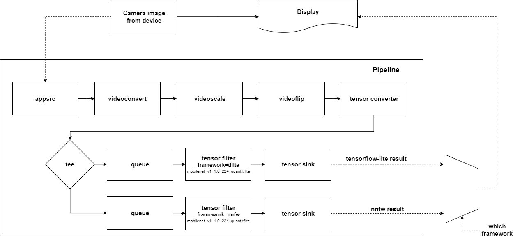

# Image Classification Sample App with NNStreamer

## Description
* This is a sample application of Tizen Native using tensorflow-lite and nnfw.
* You can choose which framework you want to get results from.
* If you want to run it on your device, Tizen 5.5 or higher is required.
* About details of NNStreamer, please check [this page](https://docs.tizen.org/application/native/guides/machine-learning/machine-learning-inference).
* The applied Tensor Flow Lite model file from [here](https://www.tensorflow.org/lite/guide/hosted_models#quantized_models).

## Result (Outdated)
 

## Graphical description of the pipeline


## How to install NNFW runtime
 * Notes: If the nnfw runtime is not installed on your Tizen device, You need to install the nnfw runtime library manually.

   Visit http://download.tizen.org/snapshots/tizen/unified/latest/repos/standard/packages/

   Download `nnfw-*.${arch}.rpm` and `libarmcl-*.${arch}.rpm` that matches your device architecture.
 * Push rpm file using SDB tool
 
   Check the device connection
   ```
   $ sdb devices
   List of devices attached 
   0000d8ae00006200    	device    	TM1
   ```
   
   Login shell
   ```
   sdb shell
   ```
     
   Push files from host to device
   ```
   $ sdb push [FILES] [remote]`
   ```

   Install rpm files
   ```
   $ rpm -ivh ${RPM_FILE} --force
   ```
   If you failed to install rpm files because read/write issue, remount rootfs as ReadWrite.
   ```
   $ mount -o remount, rw /
   ```   
