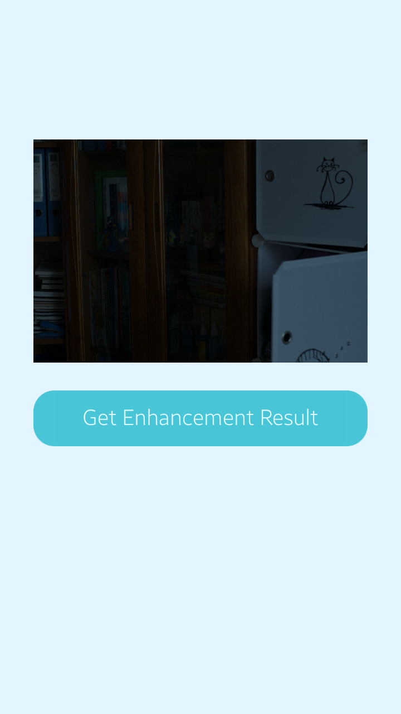
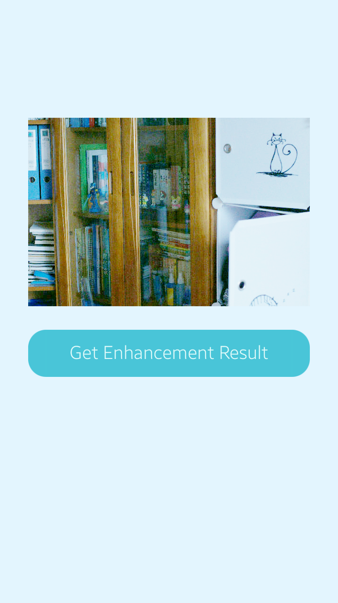

---
title: Low Light Image Enhancement
...

# Low Light Image Enhancement Sample App with NNStreamer Pipeline C-API
Tizen Native App with NNStreamer Piepeline API

## Description
* This is a sample application of Tizen Native.
* If you want to run it on your device, Tizen 6.5 or higher is required.
* About details of NNStreamer, please check [this page](https://docs.tizen.org/application/native/guides/machine-learning/machine-learning-inference).
* The applied Tensor Flow Lite model file from [here](https://tfhub.dev/sayannath/lite-model/zero-dce/1).

## Result
 

