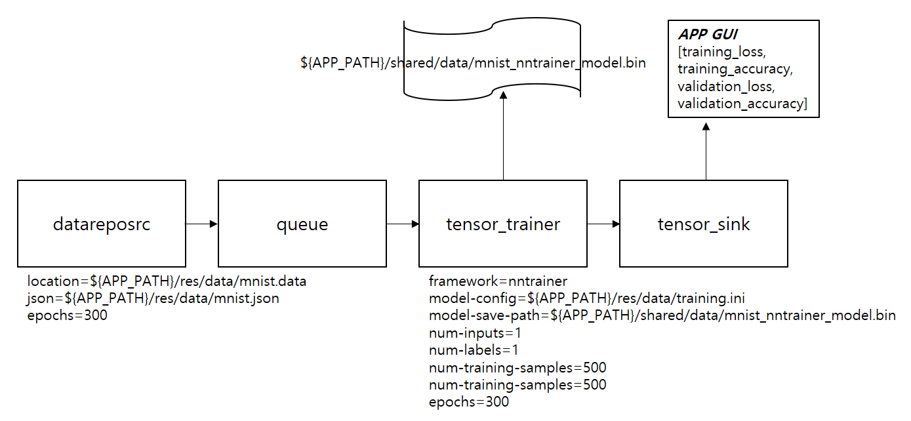
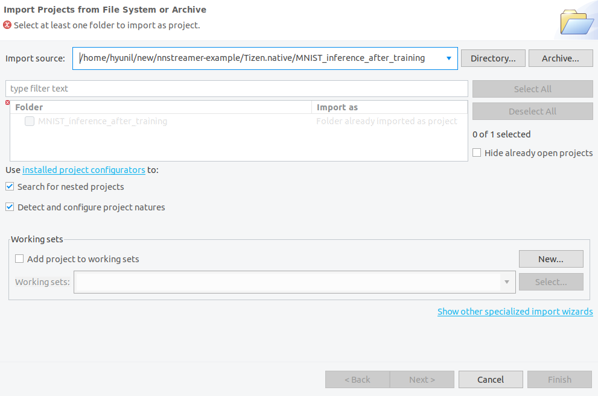
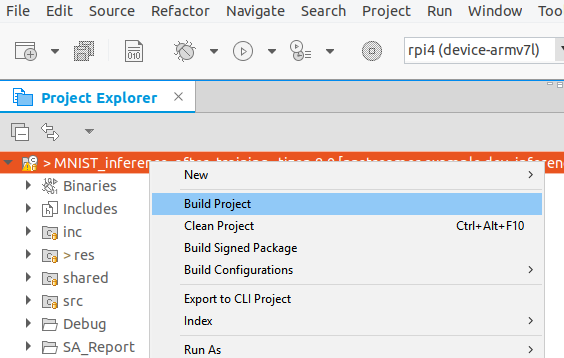
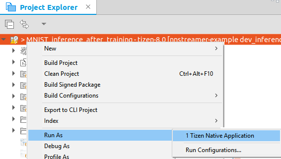

---
title: Training in AI pipeline using ml service APIs
...

## Tizen Native NNStreamer Application Example - MNIST inference after training in pipeline
### Introduction ###
This App is an example for inferring numbers after training the **object classification model(MNIST)**.

After TPK is installed, the res folder contains the resource data(mnist.data and mnist.json) needed for model training and a configured file(training.ini) for the model construction. mnist.json provides information on how the binary file(mnist.data) is structured.
**tensor_trainer** configures the model with a model configure file loaded using the [**nntrainer**](https://github.com/nnstreamer/nntrainer) framework. **datareposrc** reads the imported data and sends it to **tensor_trainer**. Now **tensor_trainer** trains the model using the received data. And every epoch, the results(training_loss, training_accuracy, validation_loss, and validation_accuracy) are sent to **tensor_sink**. **tensor_sink** delivers the results received from **tensor_trainer** to the application, and the applicaton displays the results on the screen. After seeing the results output during model training, the user can stop training if desired. 

Once training is complete, **mnist_nntrainer_model.bin** is saved in a shared directory. Now numbers can be inferred by **tensor_filter**. In the case of **nntrainer** framework, unlike other frameworks, the configure file(inference.ini) must be set in the model parameter of **tensor_filter**. The contents of **training.ini** and **inference.ini** are the same, and only Save_path is commented out in training.ini because nntrainer use the model in **Save_path** for inference. The probability value of numbers 0-9 are sent to **tensor_sink**. **tensor_sink** delivers the results received from **tensor_filter** to the application, and the applicaton displays the results on the screen.

### pipeline structure for training ###


#### mnist.json ####
mnist.json provides information on how the binary file, mnist.data, is structured.
```
{
  "gst_caps":"other/tensors, format=(string)static, framerate=(fraction)30/1, num_tensors=(int)2, dimensions=(string)28:28:1:1.10:1:1:1, types=(string)float32.float32",
  "total_samples":1000,
  "sample_size":3176
}
```

#### training.ini ####
nntrainer framework used by tensor_trainer configures the model using the model configure file.
```
# Network Section : Network

[Model]
Type = NeuralNetwork                # Network Type : Regression, KNN, NeuralNetwork
Epochs = 10                         # Epochs
Loss = cross                        # Loss function : mse (mean squared error)
                                    # cross ( for cross entropy )
#Save_Path = "/opt/usr/home/owner/apps_rw/org.example.mnist_inference_after_training/shared/data/mnist_nntrainer_model.bin"  # model path to save / read
batch_size = 10                     # batch size

[Optimizer]
Type = adam
beta1 = 0.9                         # beta 1 for adam
beta2 = 0.999                       # beta 2 for adam
epsilon = 1e-7                      # epsilon for adam

[LearningRateScheduler]
type=constant
Learning_rate = 1e-4                # Learning Rate

# Layer Section : Name
[inputlayer]
Type = input
Input_Shape = 1:28:28

# Layer Section : Name
[conv2d_c1_layer]
Type = conv2d
input_layers = inputlayer
kernel_size = 5,5
bias_initializer=zeros
Activation=sigmoid
weight_initializer = xavier_uniform
filters = 6
stride = 1,1
padding = 0,0

[pooling2d_p1]
Type=pooling2d
input_layers = conv2d_c1_layer
pool_size = 2,2
stride =2,2
padding = 0,0
pooling = average

[conv2d_c2_layer]
Type = conv2d
input_layers = pooling2d_p1
kernel_size = 5,5
bias_initializer=zeros
Activation=sigmoid
weight_initializer = xavier_uniform
filters = 12
stride = 1,1
padding = 0,0

[pooling2d_p2]
Type=pooling2d
input_layers = conv2d_c2_layer
pool_size = 2,2
stride =2,2
padding = 0,0
pooling = average

[flatten]
Type=flatten
input_layers = pooling2d_p2

[outputlayer]
Type = fully_connected
input_layers=flatten
Unit = 10                           # Output Layer Dimension ( = Weight Width )
weight_initializer = xavier_uniform
bias_initializer = zeros
Activation = softmax                # activation : sigmoid, softmax
```

### pipeline structure for inference ###
Example of inference of the number 9


### Description ###
* This is a sample application of Tizen Native for IoT device.
* If you want to run it on your device, Tizen 8.0 or higher is required.
* About details of NNStreamer, please check [this page](https://docs.tizen.org/application/native/guides/machine-learning/machine-learning-inference).

### How to Run
* Update Tizen package manager to the latest.
* RPI4 flashed with the latest tizen headed image.
* Connect PC and RPI4.
* Unzip data.zip in the res folder.
```
$unzip data.zip
```
* Launch Tizen Studio
* Import Application (File > Open projects from filesystem...)


* Build Project


* Run Application


### Result ###
If you set the epoch to 300, the accuracy is about 90%.

