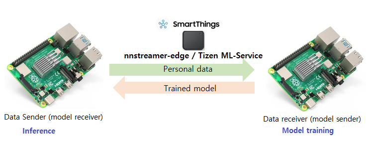
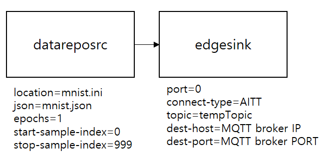
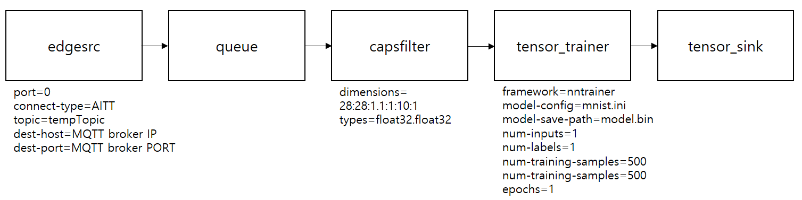
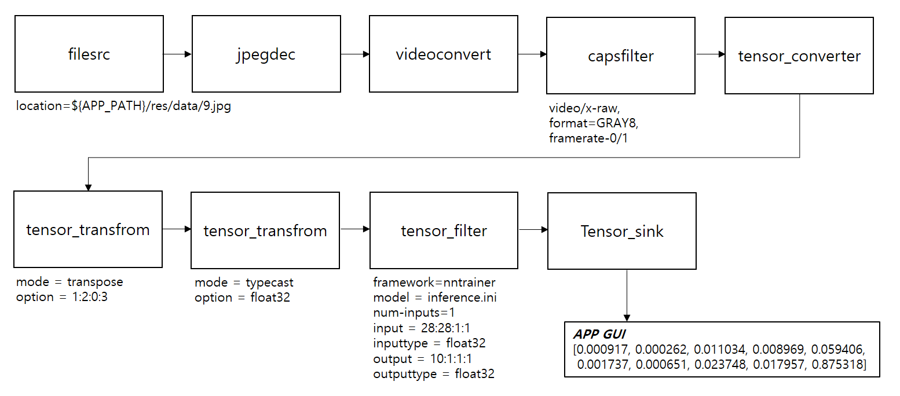
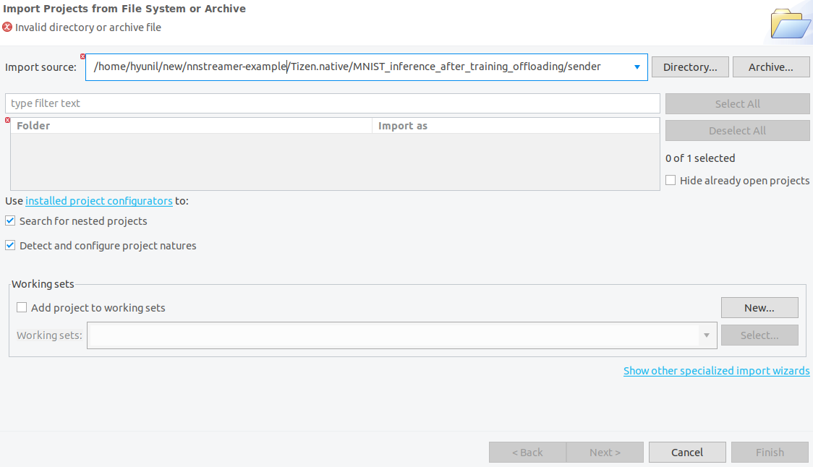
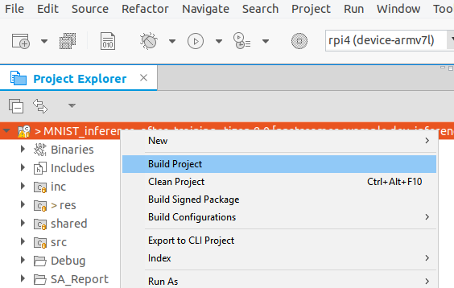
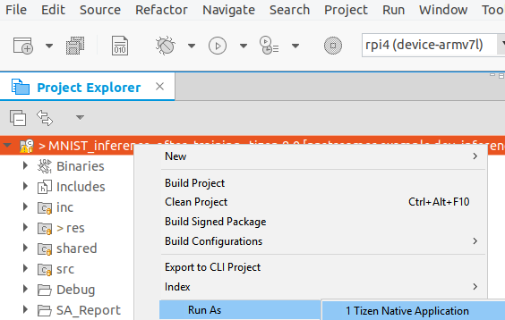
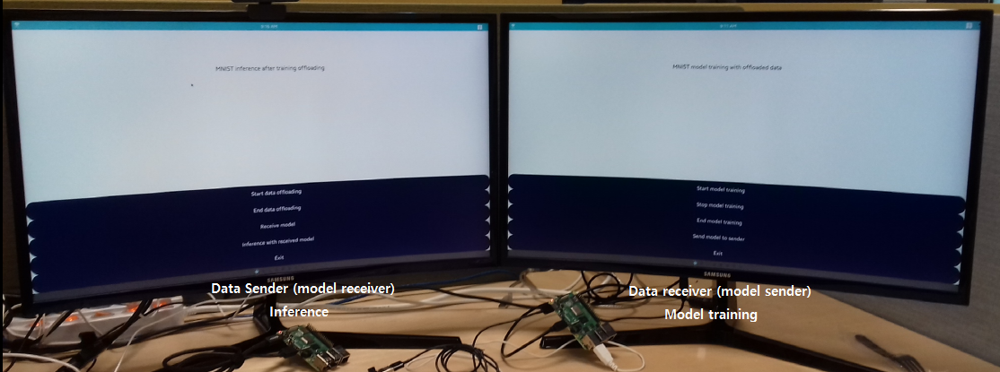
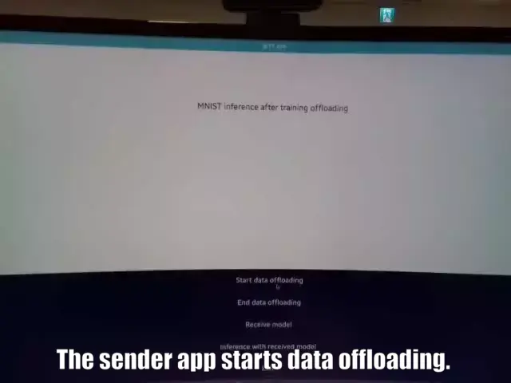

---
title: Inference after training offloading
...

## Tizen Native NNStreamer Application Example - Inference after training offloading

### Introduction
This example implements inference after training offloading between two devices in the [nnstreamer-edge](https://github.com/nnstreamer/nnstreamer-edge) network environment. This example consisits of two apps, sender and receiver. The scenario is as follows.

```
[ Data offloading ]
1. sender: offloading MNIST training data to the receiver
2. receiver: train the model with offloaded data

[ Model offloading and inference ]
3. receiver: offloading the trained model to the sender and register it in the sender's ml model repo
4. sender: receives a model and performs inference using the offloaded model
```


#### 1. Data offloading and Model Training ####
The sender reads the data required for training from ```datareposrc``` and uses ```edgesink``` to send the data to the peer device on the network. The receiver reads the received data from the peer device using ```edgesrc``` and pushes it to tensor_trainer. Then tensor_trainer trains the model using the data. Data transmission and reception between ```edgesink``` and ```edgesrc``` in the network is carried out through MQTT broker. User does not need to know the details and only needs to match the ```dest-host(IP)```, ```dest-port```, ```connect-type``` and ```topic``` of the MQTT broker to connect ```edgesrc``` and ```edgesink```.

#### sender pipeline for data offloading ####
The sender is configured as follows. ```datareposrc``` reads data from the location path with ```JSON``` meta information. ```datareposrc``` repeatedly reads the data as many as ```epochs``` from ```start-sample-index``` to ```stop-sample-index``` among the entire data set. The default value of ```epochs``` is 1, the default value of ```start-sample-index``` is 0 and the default value of ```stop-sample-index``` is the total number of samples -1. If you use the default value, you do not need to set the value. ```edgesink``` uses nnstreamer-edge network environment. ```edgesink``` connect to ```MQTT broker``` so it needs to run ```systemctl start mosquitto```. The connection type of ```edgesink``` is ```AITT``` and the topic is ```tempTopic```. ```dest-host``` and ```dest-port``` are the IP and port of the MQTT broker. set dest-host and dest-port to connect to the MQTT broker.

#### mnist.json ####
mnist.json provides information on how the binary file, mnist.data, is structured.
```
{
  "gst_caps":"other/tensors, format=(string)static, framerate=(fraction)30/1, num_tensors=(int)2, dimensions=(string)28:28:1:1.10:1:1:1, types=(string)float32.float32",
  "total_samples":1000,
  "sample_size":3176
}
```



#### receiver pipeline for model training with offloaded data ####
The receiver is configured as follows. To receive data from a peer device, ```edgesrc``` uses nnstreamer-edge network environment. As with the sender, ```edgesrc``` connects to MQTT broker so it needs to run ```systemctl start mosquitto```. The connection type of ```edgesrc``` is ```AITT``` and the topic is ```tempTopic```. ```dest-host``` and ```dest-port``` are the IP and port of the MQTT broker. set dest-host and dest-port to connect to the MQTT broker.
Now, the received data is passed to tensor_trainer. Set the ```framework``` to use for training the model, configure the model with ```model-config``` file and set ```model-save-path``` to save a model. For input caps of tensor_trainer, refer to gst_caps in JSON file or check the input format of model-config. Users will know the format of the data used for model training and the number of inputs and labels. The preprocessed data affects the performance of model training. Set ```num-inputs``` and ```num-labels```(both default value is 1). It needs to set how many of the input data being used for training and validation for model training, and set the number of epochs. The properties for these are ```num-training-samples```, ```num-validation-samples```, and ```epochs``` respectively.



#### mnist.ini ####
nntrainer framework used by tensor_trainer configures the model using the model configure file.
```
# Network Section : Network

[Model]
Type = NeuralNetwork                # Network Type : Regression, KNN, NeuralNetwork
Epochs = 10                         # Epochs
Loss = cross                        # Loss function : mse (mean squared error)
                                    # cross ( for cross entropy )
#Save_Path = "/opt/usr/home/owner/apps_rw/org.example.mnist_inference_after_training/shared/data/mnist_nntrainer_model.bin"  # model path to save / read
batch_size = 10                     # batch size

[Optimizer]
Type = adam
beta1 = 0.9                         # beta 1 for adam
beta2 = 0.999                       # beta 2 for adam
epsilon = 1e-7                      # epsilon for adam

[LearningRateScheduler]
type=constant
Learning_rate = 1e-4                # Learning Rate

# Layer Section : Name
[inputlayer]
Type = input
Input_Shape = 1:28:28

# Layer Section : Name
[conv2d_c1_layer]
Type = conv2d
input_layers = inputlayer
kernel_size = 5,5
bias_initializer=zeros
Activation=sigmoid
weight_initializer = xavier_uniform
filters = 6
stride = 1,1
padding = 0,0

[pooling2d_p1]
Type=pooling2d
input_layers = conv2d_c1_layer
pool_size = 2,2
stride =2,2
padding = 0,0
pooling = average

[conv2d_c2_layer]
Type = conv2d
input_layers = pooling2d_p1
kernel_size = 5,5
bias_initializer=zeros
Activation=sigmoid
weight_initializer = xavier_uniform
filters = 12
stride = 1,1
padding = 0,0

[pooling2d_p2]
Type=pooling2d
input_layers = conv2d_c2_layer
pool_size = 2,2
stride =2,2
padding = 0,0
pooling = average

[flatten]
Type=flatten
input_layers = pooling2d_p2

[outputlayer]
Type = fully_connected
input_layers=flatten
Unit = 10                           # Output Layer Dimension ( = Weight Width )
weight_initializer = xavier_uniform
bias_initializer = zeros
Activation = softmax                # activation : sigmoid, softmax
```

#### 2. Model offloading ####
To offload the trained model, the roles of sender and receiver are reversed.
The receiver(model sender) and the sender(model receiver) create ```ml_option_h``` and set ```dest-host```, ```dest-port```, ```connect-type```, ```host```, and ```topic``` to connect nnstreamer-edge network. And both sender and receiver create remote servece with ```ml_remote_service_create``` for model offloading.
To offload the model, the receiver(model sender) must call ```ml_remote_service_register```. This API registers a trained model in the ```ml model repo``` of the remote sender(model receiver). The receiver(model sender) must create ```ml_service_h``` and set ```service-type```, ```service-key```, and etc to use the API. 
The sender(model receiver) receives the model and can obtain the registered model path with ```service-key``` used by The receiver(model_sender). Please refer to the function ```start_model_receiver()``` and ```start_model_sender()```.

#### 3. Inference ####
Onece training offloading is complete, mnist_nntrainer_model.bin is saved in a shared directory of the sender app. Now numbers can be inferred by tensor_filter. In the case of nntrainer framework, unlike other frameworks, the configure file(inference.ini) must be set in the model parameter of tensor_filter. The contents of training.ini and inference.ini are the same, and only Save_path is commented out in training.ini because nntrainer use the model in Save_path for inference. The probability value of numbers 0-9 are sent to tensor_sink. tensor_sink delivers the results received from tensor_filter to the application, and the applicaton displays the results on the screen.

##### pipeline for inference ####
Example of inference of the number 9



### Description ###
* This is a sample application of Tizen Native for IoT device.
* If you want to run it on your device, Tizen 8.0 or higher is required.
* About details of NNStreamer, please check [this page](https://docs.tizen.org/application/native/guides/machine-learning/machine-learning-inference).

### How to Run
* Update Tizen package manager to the latest.
* Prepare 2 RPI4 units.
* RPI4 flashed with the latest tizen headed image.
* Install mosquitto package on RPI4 to use MQTT, download rpm (mosquitto and mosquitto-client) from [this page](http://download.tizen.org/snapshots/TIZEN/Tizen/Tizen-Unified/reference/repos/standard/packages/)(There are armv7l and aarch64 architectures for RPI4.)
```
  [host]
  sdb push mosquitto-1.6.8-0.armv7l.rpm mosquitto-clients-1.6.8-0.armv7l.rpm
  or
  sdb push mosquitto-1.6.8-0.aarch64.rpm mosquitto-clients-1.6.8-0.aarch64.rpm
  
  [target]
  rpm -Uvh *.rpm
  cd /etc/mosquitto
  cp mosquitto.conf.example mosquitto.conf
  systemctl start mosquitto
```
* Connect PC and RPI4 for sender application.
* Unzip data.zip in the res folder.
* Launch Tizen Studio
* Import Application (File > Open project from filesystem...)
* Build and Run
* Disconnect RPI4 from PC for connect to the other RPI4
* Connect PC and RPI4 for receiver application.
* Launch Tizen Studio
* Import Application (File > Open project from filesystem...)
* Build and Run

#### How to import app to Tizen studio ####
* Launch Tizen Studio
* Import sender application (File > Open projects from filesystem...)

* import receiver application the same way.


#### How to build and run ####
* Build project

* Run Application

* After installing the application, run it by clicking app icon

### Result ###


If you set the epoch to 300, the accuracy is about 90%.

The result is 2x speed.


