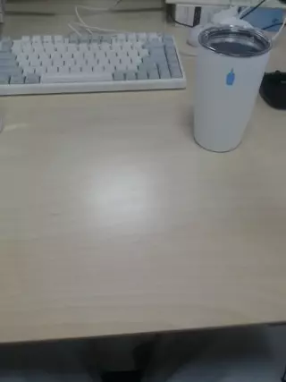

---
title: Object Detection
...

# Object Detection Sample App with NNStreamer Pipeline C-API
Tizen Native App with NNStreamer Pipeline API

## Description
* This is a sample application of Tizen Native.
* If you want to run it on your device, Tizen 5.5 or higher is required.
* About details of NNStreamer, please check [this page](https://docs.tizen.org/application/native/guides/machine-learning/machine-learning-inference).
* The applied Tensor Flow Lite model file can be dowloaded from [here](https://github.com/nnsuite/testcases/tree/master/DeepLearningModels/tensorflow-lite/ssd_mobilenet_v2_coco). More models can be downloaded from [here](https://www.tensorflow.org/lite/guide/hosted_models#quantized_models).

## Working
* Set the camera on but dont diplay it directly.
* Capture the frame from camera before its preview with preview\_cb.
* Process the captured frame with the set pipeline and get the output frame.
* The output frame is rendered and display object updated.
* [WIP] Mixing the output bounding boxes with original frames.

## Result

