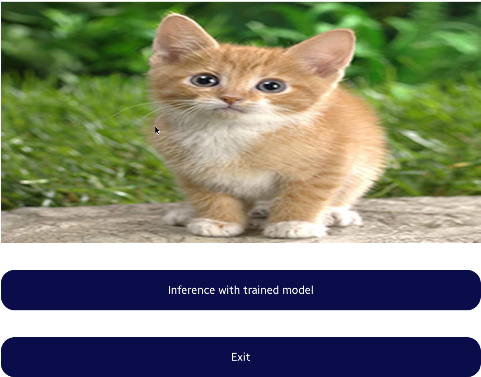
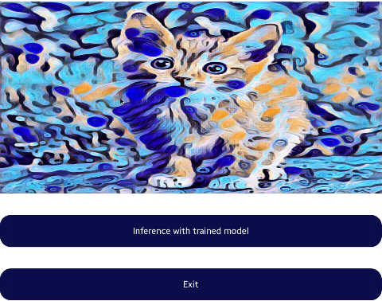

---
title: Style Transfer Onnx
...

# Style Transfer Onnx Sample App with NNStreamer Pipeline C-API
Tizen Native App with NNStreamer Piepeline API

## Description
* This is a sample application of Tizen Native.
* If you want to run it on your device, Tizen 9.0 or higher is required.
* If you want to run it on Tizen 8.0 devices, you need to install  the latest packages of nnstreamer-onnxruntime and machine-learning-service.
* About details of NNStreamer, please check [this page](https://docs.tizen.org/application/native/guides/machine-learning/machine-learning-inference).
* The applied ONNX model file from [here](https://github.com/onnx/models/blob/main/validated/vision/style_transfer/fast_neural_style/README.md).

## Result
 

