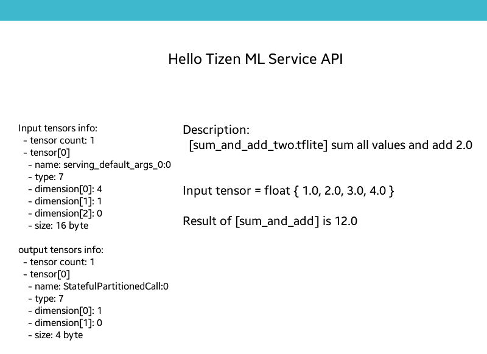

# Example of using ML Service APIs with RPKs

## org.example.sum_and_add

This app prints invoke results of `sum_and_add` model from rpk. Depend on the rpk version, the output should be different.

## RPK "org.resource.model.sum_and_add" v1

This RPK contains `sum_and_add` model file, `sum_and_add_one.tflite`. Made by this python script:

```python
import torch
import ai_edge_torch

class AddModelOne(torch.nn.Module):
  def __init__(self):
    super().__init__()

  def forward(self, input_tensor):
    output = torch.sum(input_tensor, (1)) + 1.0
    return output # sum all value of input tensor and add 1.0

sum_and_add_one = AddModelOne().eval()
sum_and_add_one(torch.tensor([[1.0, 2.0, 3.0, 4.0]])) # output: tensor([11.])

sample_inputs = (torch.randn(1, 4),) # restrict the shape of input as (1, 4)
edge_model = ai_edge_torch.convert(sum_and_add_one, sample_inputs) # convert the model
edge_model(torch.tensor([[1.0, 2.0, 3.0, 4.0]])) # validate the output: tensor([11.])
edge_model.export("sum_and_add_one.tflite") # save as tflite model file
```

## RPK "org.resource.model.sum_and_add" v2

This RPK contains `sum_and_add` model file, `sum_and_add_two.tflite`. Made by:

```python
class AddModelTwo(torch.nn.Module):
  def __init__(self):
    super().__init__()

  def forward(self, input_tensor):
    output = torch.sum(input_tensor, (1)) + 2.0
    return output # sum all value of input tensor and add 2.0

sum_and_add_two = AddModelTwo().eval()
sum_and_add_two(torch.tensor([[1.0, 2.0, 3.0, 4.0]])) # output: tensor([12.])

sample_inputs = (torch.randn(1, 4),) # restrict the shape of input as (1, 4)
edge_model = ai_edge_torch.convert(sum_and_add_two, sample_inputs) # convert the model
edge_model(torch.tensor([[1.0, 2.0, 3.0, 4.0]])) # validate the output: tensor([12.])
edge_model.export("sum_and_add_two.tflite") # save as tflite model file
```

## Scenario

The app `org.example.sum_and_add` uses AI defined in the RPK `org.resource.model.sum_and_add`.

1. install RPK `org.resource.model.sum_and_add` V1

    ```bash
    cd sum_and_add_model_rpk_v1
    tizen package -t rpk -- .
    tizen install -n "./Package/org.resource.model.sum_and_add-1.0.0.rpk"
    ```

2. Install and run the app `org.example.sum_and_add`

    ```bash
    cd sum_and_add_app
    tizen build-native -r tizen-9.0-device64.core -- .
    tizen package -t tpk -- ./Debug
    tizen install -n "./Debug/org.example.sum_and_add-1.0.0-aarch64.tpk"
    tizen run -p "org.example.sum_and_add"
    ```

    

3. Update the RPK with V2 and run the app again

    ```bash
    cd sum_and_add_model_rpk_v2
    tizen package -t rpk -- .
    tizen install -n "./Package/org.resource.model.sum_and_add-2.0.0.rpk"
    tizen run -p "org.example.sum_and_add"
    ```

    The result of app is changed:
    

## Note

The app `org.example.sum_and_add` is packaged and deployed only once. Developers can update the app's AI model with RPK update.
