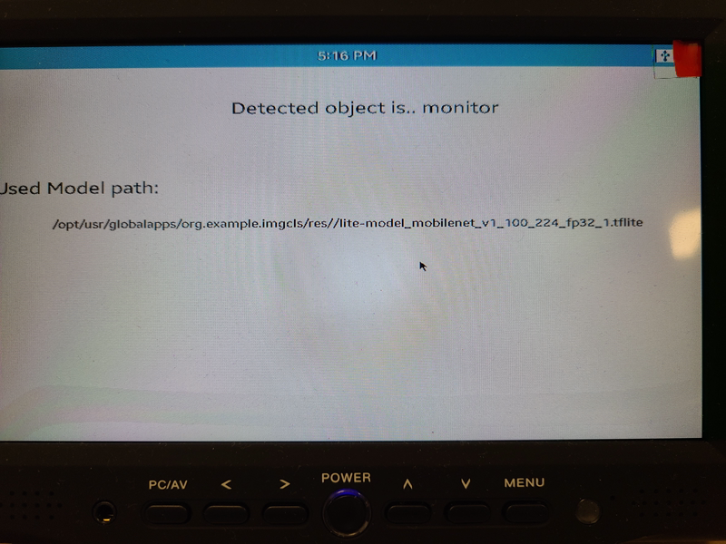
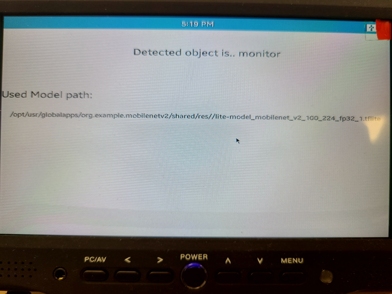
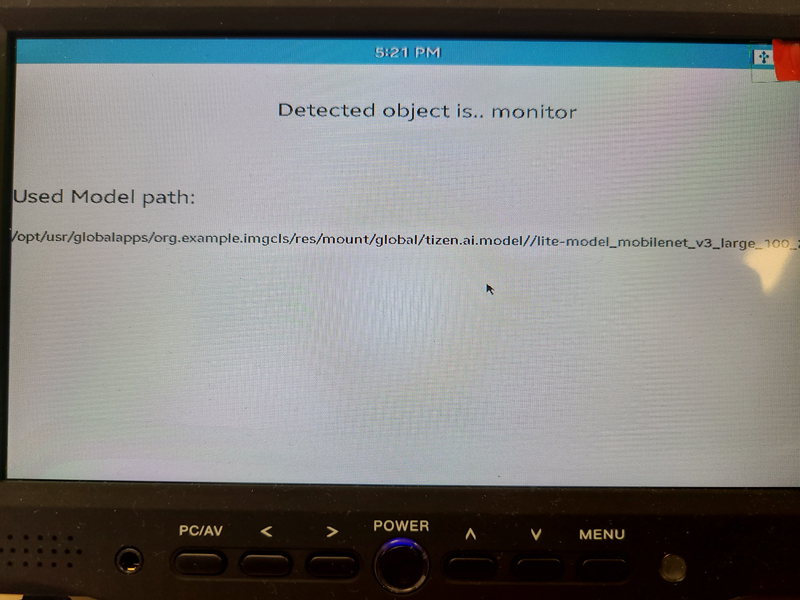

# Example of using ML Service APIs

## org.example.imgcls

- This app prints a detected object from a simple ml pipeline. Used neural net is mobilenet.

### Scenario

1. The app imgcls uses its own neural network model file - lite-model_mobilenet_v1_100_224_fp32_1.tflite

2. org.example.mobilenetv2 is installed in device with new model file - lite-model_mobilenet_v2_100_224_fp32_1.tflite. When it is launched, this new model is registered by Machine Learning Service API.
3. Without any code change in imgcls app, imgcls uses the new model file.


### Scenario using [Tizen Resource Package](https://docs.tizen.org/application/tizen-studio/native-tools/rpk-package/)

1. When the org.resource.mobilenetv3 tizen resource package (rpk) is installed, a daemon running in the Tizen device registers model files based on the provided "rpk_config.json"
2. Without any change to imgcls app, it uses newly installed model file.


### Note

- This scenario utilize Tizen's ML Service Model APIs.
- All apps share the same key. In this scenario it's "imgcls-mobilenet-224-224-fp".
- TPK applications mobilenetv2 register their model file via `ml_service_model_register`
- imgcls app get the registered and activated model file with `ml_service_model_get_activated`
- If there is no activated model in the device, it fallbacks to the default its own mobilenet_v1 model file.

### Requirements

- rpi4 flashed with the latest tizen-headed (64bit) image
- monitor connected to the rpi4
- webcam connected to the rpi4
- tizen SDK
- latest rootstrap to build those tpks

### Build / Run guide

- build / package / install / run with tizen CLI commands:
  ```bash
  $ pushd ml-svc-model/imgcls
  $ wget --content-disposition https://tfhub.dev/iree/lite-model/mobilenet_v1_100_224/fp32/1?lite-format=tflite -P res/
  $ tizen build-native -- .
  $ tizen package -t tpk -- ./Debug
  $ tizen install -n "./Debug/org.example.imgcls-1.0.0-aarch64.tpk"
  $ tizen run -p "org.example.imgcls" // run with default model

  $ popd
  $ pushd ml-svc-model/mobilenetv2
  $ wget --content-disposition https://tfhub.dev/iree/lite-model/mobilenet_v2_100_224/fp32/1?lite-format=tflite -P shared/res/
  $ tizen build-native -- .
  $ tizen package -t tpk -- ./Debug
  $ tizen install -n "./Debug/org.example.mobilenetv2-1.0.0-aarch64.tpk"
  $ tizen run -p "org.example.mobilenetv2"
  $ tizen run -p "org.example.imgcls" // run with the new model
  $ popd

  $ pushd ml-svc-model/mobilenetv3-rpk
  $ wget --content-disposition https://tfhub.dev/iree/lite-model/mobilenet_v3_large_100_224/fp32/1?lite-format=tflite -P res/global/tizen.ai.model/
  $ tizen package -t rpk -- .
  $ tizen install -n "./Package/org.resource.mobilenetv3-1.0.0.rpk"
  $ tizen run -p "org.example.imgcls" // run with the new model from rpk
  $ popd
  ```
