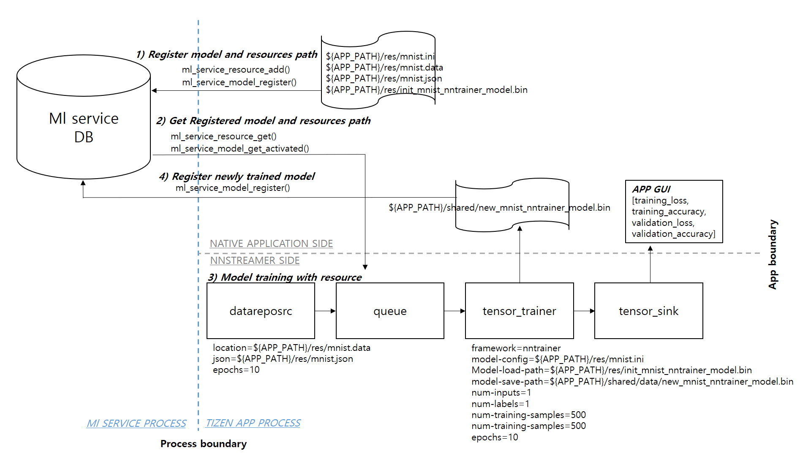
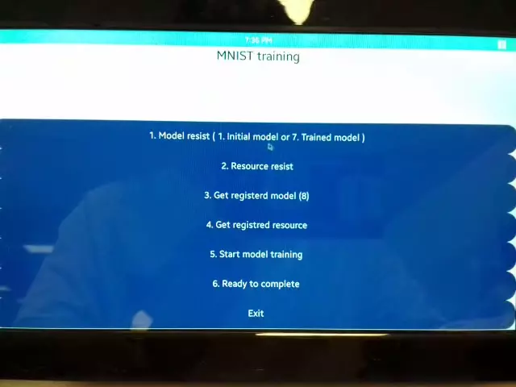

---
title: Training in AI pipeline using ml service APIs
...

## Tizen Native NNStreamer Application Example - Training in AI pipeline using ml service APIs
### Introduction ###
This App is an example for training **object classfication model(MNIST)**, this is  configuring an ml AI pipeline using **datareposrc** and **tensor_trainer** for model training and using ml service APIs to manage the resources and trained models. Look at the **application structure** below. After TPK is installed, the res folder contains the resource data needed for model training, a configured file for the model construction, and an initial trained model(for test). This resource and initial model must register with the ml service using the **ml service APIs**, and the registered resources and an initial model are imported by **ml service APIs** for training in AI pipeline. **tensor_trainer** load the initial training model that stored weights. (Of course, training is possible without loading. However, for testing purposes, loading is performed here.) And **datareposrc** reads the imported data and sends it to **tensor_trainer**. Now **tensor_trainer** trains the model using the received data. And every epoch, the results(training_loss, training_accuracy, validation_loss, and validation_accuracy) are sent to **tensor_sink**. **tensor_sink** delivers the results received from **tensor_trainer** to the application, and the applicaton displays the results on the screen. After seeing the results output during model training, the user can stop training if desired. Once learning is complete, register the saved model in the ml service using the **ml service API**. It can also be checked the just registered model using the **ml service API**.

The **Object classification model(MNIST)** was trained to verify scenario operation. the resources are mnist.data, mnist.json, mnist.ini, and init_mnist_nntrainer_model.bin.

### Applicaton structure ###

In this App, **ml_service_resource_add()** and **ml_service_model_register()** are used to register the initial model and resources path, and **ml_service_resource_get()** and **ml_service_model_get()** to get the registered model and resource path. After setting the required resource path, model load path, and model save path, start model training. Results are displayed on the APP screen for each epoch. When training is completed, the model is saved in the model save path and registered with **ml_service_model_register()**.

### Description ###
* This is a sample application of Tizen Native for IoT device.
* If you want to run it on your device, Tizen 8.0 or higher is required.
* About details of NNStreamer, please check [this page](https://docs.tizen.org/application/native/guides/machine-learning/machine-learning-inference).

### Result ###

