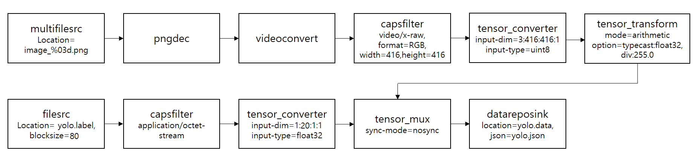
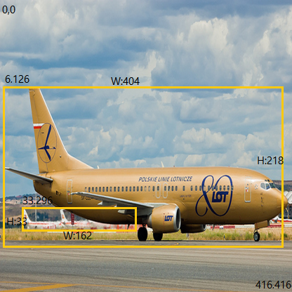
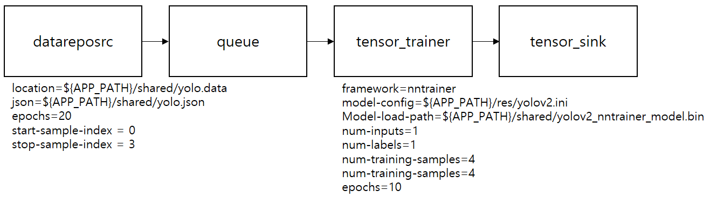
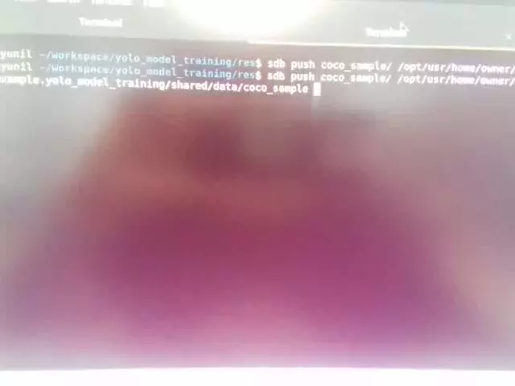

---
title: Tizen Native NNStreamer Application Example - YOLO model training in AI pipeline after data preprocessing
...

## Tizen Native NNStreamer Application Example - YOLO model training in AI pipeline after data preprocessing

### Introduction
This is an example of preprocessing the data(**images and annotations**) to be used in the YOLO model and training **YOLO model(Object detection)** using the preprocessed data(**yolo.data, yolo.json**). YOLO Model training takes a long time even on a PC. Therefore, this example will simply show the process of preprocessing four images and then training them.


### 1. Data preprocessing
 This example generates the tensor data(**yolo.data**) and meta-information(**yolo.json**) of Gstreamer-pipeline using **datareposink**. The dataset consist of four resized(416x416) COCO Image files and a text file with annotation information(class, x, y, width and height). this dataset is changed to the feature and label tensor data required for the model and becomes one tensor data using **tensor_mux** with ```sync-mode=nosync``` (https://github.com/nnstreamer/nnstreamer/blob/main/Documentation/synchronization-policies-at-mux-merge.md).

##### Pipeline structure for data preprocessing


The person using the model needs to know how to construct the model and what data formats are required. The performance of the model is related to the construction of the model and the preprocessed data. Depending on the model you are using, the data preprocessing method will be different. This is an example of a model that takes one feature and one label as input. Feature uses RGB (3x416x416) and normalized values between 0 and 1 of float32. To use a label file in gstreamer-pipeline, the label data is saved as a binary file in the format required by the model in the **create_label_file()**. labels store the location information of up to 4 objects in one image (filled with zeros if the number of objects is insufficient).

[000000005477.txt] 
```
4 6 126 404 218
4 33 296 162 33
```
The values are Class:4(airplane), X:6, Y:126, W:404 and H:128

[000000005477.png]



Images need to be renamed with placeholders in order to be used in **multifilesrc**.
This example constructs a file list using **g_dir_open()** and renames each file by **images_%03d.jpg**
```
e.g. rename("000000005477.jpg", "image_003.jpg");
```

### 2. Training YOLO model(Object detection)
To train the YOLO model, **tensor_trainer** in the AI pipeline configures the model with the attached configure file(**yolov2.ini**). And **datareposrc** reads yolo.data and yolo.json and sends tensor data to **tensor_trainer**. **tensor_trainer** trains the YOLO model with the received tensor data and delivers the results(training loss, training accuracy, validation loss, validation accuracy) to **tensor_sink** every epoch. When training is finished, the YOLO model is saved.

##### Pipeline structure for training



### Description
* This is a sample application of Tizen Native for IoT device.
* If you want to run it on your device, Tizen 8.0 or higher is required.
* For details on NNStreamer, please check [this page](https://docs.tizen.org/application/native/guides/machine-learning/machine-learning-inference).


### How to Run
Go to [snapshots](http://download.tizen.org/snapshots/TIZEN/Tizen/Tizen-Unified/reference/repos/standard/packages/armv7l/). And download the latest nntrainer-applications rpm to use yolo layer.

```
$sdb push nntrainer-applications-x.x.x-x.armv7l.rpm /tmp
$cd /tmp
$rpm -Uvh --force --nodeps nntrainer-applications-x.x.x-x.armv7l.rpm
```
Now, libyolov2_loss_layer.so and libreorg_layer.so are installed in /usr/lib/nntrainer/layers.
(If it is installed in /usr/lib/nntrainer/bin/application, please copy.)

Run example and extract coco_sample.zip in the res folder. And push data to the **shared** folder.
```
$unzip coco_sample.zip
$sdb push coco_sample  /opt/usr/home/owner/apps_rw/org.example.yolo_model_training/shared/data/coco_sample
```
Preprocess the data and start model training

### Result
nntrainer's yolo loss layer currently has no way to deliver training results to the app in real-time. Therefore, let's check it with the log.


