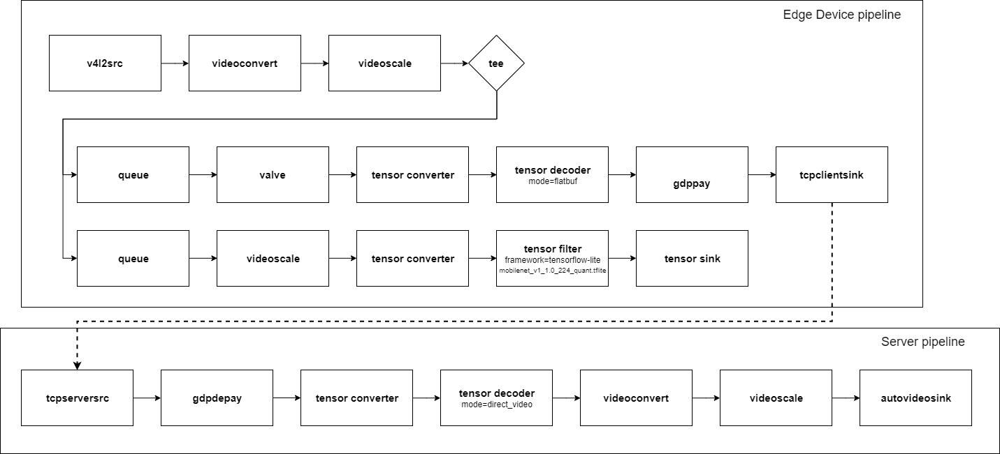

# Image classification with Tizen IoT platform
This application provides example of edge AI using nnstreamer.

An edge device (tested with Raspberry Pi 4) runs machine learning algorithm which might not be as powerful.

The device analyzes the camera image before transmitting it, and then transmits meaningful information only.

In this example, if the device finds a target that the user wants, it starts video streaming to the server.

# Graphical description of pipeline


# HOW TO USE
To get RPM file, please run below command first.
```bash
$ ./gen_tizen_iot_image_classification_rpm.sh
```
you can check the rpm files at your ${GBS-ROOT}

After gbs build and install at your target, you can execute it with below command.
```
$ nnstreamer_tizen_iot_text_classification ${TCP_SERVER_OR_CLIENT} ${TARGET} ${IP_ADDRESS} ${PORT_NUMBER}
# e.g. $ nnstreamer_tizen_iot_image_classification server orange 192.168.1.1 5001
```
