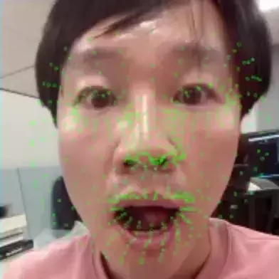

---
TITLE: nnstreamer example application for face landmark on tizen platform
...

# MODEL INFORMATION

* model link : https://github.com/google/mediapipe/blob/master/mediapipe/modules/face_landmark/face_landmark.tflite
* model type : Convolutional Neural Network

* input: floate32[1,192,192,3]

Captured frame should contain a single face placed in the center of the image. 
there should be a margin around the face calculated ad 25% of face size.

* output: floate32[1,1,1,1404]

Facial surface represented as 468 3D landmarks flattened into a 1D tensor:(x1,y1,z1),(x2,y2,z2)... x- and y-coordinates follow the image pixel coordinates; z-coordinates are relative to the face center of mass and are scaled proportionally to the face width.
The points have been manually selected in accordance with the supposed applications, such as expressive AR effects, virtual accessory and apparel try-on and makeup.

* output: floate32[1,1,1,1]

Face flag indicating the likelihood of the face being present in the input image. Used in tracking mode to detect that the face was lost and the face detector should be applied to obtain a new face position.

#GRAPHICAL DESCRIPTION OF PIPELINE


# HOW TO USE

* host
To get RPM file, please run below command first.
```bash
$./gen_tizen_iot_face_landmark_rpm.sh
```
After gbs build, you can get the rpm file at your local repo.
You can check the log "generated RPM packages can be found from local repo" and path.
Goto local repo and push rpm to target.
```bash
$sdb push tizen-iot-face-landmark-app-0.0.1-0.armv7l.rpm /opt
```
push tensorflow model to target
```bash
$sdb push ./res/face_landmark.tflite /opt/usr/home/owner
```
* target
To install rpm file
```bash
#mount -o remount rw, /
#cd opt
#rpm -Uvh --force --nodeps tizen-iot-face-landmark-app-0.0.1-0.armv7l.rpm
```
To run applicaton
```bash
#export ELM_ENGINE=wayland_egl
#export XDG_RUNTIME_DIR=/run/
#export ELM_PROFILE="common"

#tizen_iot_face_landmark
```
ELM_PROFILE are common, tv and mobile

#SCREENSHOT



