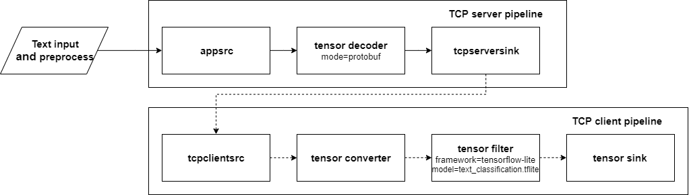

# Text classification with Tizen IoT platform
This sample application provides a guide for how to use the nnstreamer on Tizen IoT platform.
Text classifications are classified into predefined groups based on sentences. Pre-trained models predict whether a paragraph is positive or negative.
The model is downloaded here : https://www.tensorflow.org/lite/models/text_classification/overview

# Graphical description of pipeline


# HOW TO USE
To get RPM file, please run below command first.
```bash
$ ./gen_tizen_iot_text_classification_rpm.sh
```
you can check the rpm files at your ${GBS-ROOT}

After gbs build and install at your target, you can execute it with below command.
```
$ nnstreamer_tizen_iot_text_classification ${TCP_SERVER_OR_CLIENT} ${IP_ADDRESS} ${PORT_NUMBER}
# e.g. $ nnstreamer_tizen_iot_text_classification server 192.168.1.1 5001
```
