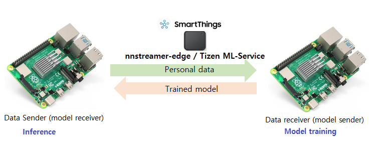
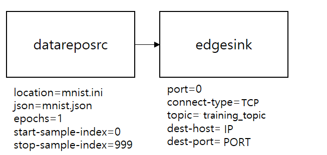
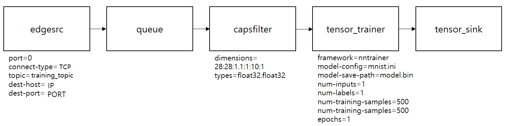

---
title: On device AI training offloading service example
...

## On device AI training offloaing service example

### Introduction
This service was developed to support AI services for low-spec products and perform on-device AI training using peripheral devices in the home without external data transmission. A simple example is to transmit learning data from a low-spec device to a high-spec device and train a model with received data on the high-spec device. Then, the trained model is transmitted to the low-spec device. This example performs on-device AI training offloading between two devices in the [nnstreamer-edge](https://github.com/nnstreamer/nnstreamer-edge) network environment. This example is implemented using the [ml-service API](https://github.com/nnstreamer/api) and acts as a sender or receiver depending on the contents of the config.

The scenario is as follows.

```
[ Data offloading ]
1. sender: offloading MNIST training data to the receiver
2. receiver: train the model with offloaded data

[ Model offloading ]
3. receiver: offloading the trained model to the sender and register it in the sender's ml model repo
```



#### 1. Service Development
For the on-device AI training offloading service, we use the Conf file and the ml service API defined [in ml-api-service.h](https://github.com/nnstreamer/api/blob/main/c/include/ml-api-service.h). The ml service API reads the information required for the service from the Conf file and calls the training offloading service API implemented internally to provide the on-device AI training offloading service.

#### 2. List of APIs used by this app
```
int ml_service_new (const char *config, ml_service_h *handle);
int ml_service_set_information (ml_service_h handle, const char *name, const char *value);
int ml_service_set_event_cb (ml_service_h handle, ml_service_event_cb cb, void *user_data);
int ml_service_start (ml_service_h handle);
int ml_service_stop (ml_service_h handle);
int ml_service_destroy (ml_service_h handle);
```

#### 3. Conf file description
In fact, adding a comment to JSON will cause an error, but for convenience, I added an explanation with #.
#### [sender.conf]
```
{
    "offloading" : # Keyword to use remote offloading service using conf-based ml service API
    {
        "node-type" : "sender", # sender is the remote that sends the file
        "dest-host" : "192.168.0.7", # IP address of receiver
        "dest-port" : "3003", # Ports to be used by sender and receiver
        "host" : "192.168.0.5", # IP address of this device
        "connect-type" : "TCP", # How to connect between sender and receiver
        "topic" : "offloading_service_test_topic", # Topic promised when connecting to MQTT
        "training" : # To use the on-device AI training offloading service among the offloading services, there must be a training field.
        {
            "sender-pipeline" : "datareposrc location=@APP_RW_PATH@/mnist.data json=@APP_RW_PATH@/mnist.json epochs=1 tensors-sequence=0,1 stop-sample-index = 9 ! edgesink port=0 connect-type=TCP topic=training_topic host=192.168.0.5 port=3110 wait-connection=true connection-timeout=10000000", # Description of pipeline to be performed by Sender
            "transfer-data" : # Data to be transmitted to the remote receiver, the receiver uses this data to learn the model.
            { # @APP_RW_PATH@ is automatically converted to the file path set by the app.
                "service_1" : "@APP_RW_PATH@/pretrained-mnist.bin", # Pre-trained model file (optional)
                "service_2" : "@APP_RW_PATH@/mnist.ini", # Model configuration file
                "service_3" : 
                {
                    "pipeline" : # Pipeline description to be performed in the remote receiver.
                    {
                        "description" : "edgesrc dest-host=192.168.0.5 dest-port=3110 connect-type=TCP topic=training_topic ! queue ! other/tensors, format=static, num_tensors=2, framerate=0/1, dimensions=28:28:1:1.1:1:10:1, types=float32.float32 ! tensor_trainer name=trainer_nntrainer framework=nntrainer model-save-path=@TRAINED_MODEL_FILE@ model-config=@REMOTE_APP_RW_PATH@/registered-mnist.ini model-load-path=@REMOTE_APP_RW_PATH@/registered-mnist.bin num-training-samples=5 num-validation-samples=5 epochs=1 ! tensor_sink name=training_result async=true",
                        "output_node" : [
                            {
                                "name" : "training_result",
                                "info" : [
                                    {
                                        "type" : "float64",
                                        "dimension" : "1:1:4:1"
                                    }
                                ]
                            }
                        ],
                        "training_node" : [
                            {
                               "name" : "trainer_nntrainer"
                            }
                        ]
                    }
                }
            }
        }
    },	
    "services" :
    {
        "service_1" : # The pre-trained model to be transmitted is registered in the Remote Receiver with the following information.
        {
            "name" : "registered-mnist.bin",
            "service-type" : "model_raw",
            "service-key" : "model_registration_key",
            "activate" : "true",
            "description" : "pretrined model"
        },
        "service_2" : # The model configuration file to be transmitted is registered in the Remote Receiver with the following information.
        {
            "name" : "registered-mnist.ini",
            "service-type" : "model_raw",
            "service-key" : "model_config_registration_key",
            "activate" : "true",
            "description" : "model configuration file"
        },
        "service_3" : # The pipeline description to be transmitted is registered in the Remote Receiver with the following information.
        {
            "service-type" : "pipeline_raw",
            "service-key" : "pipeline_registration_key",
            "description" : "temp description for remote pipeline registeration test using raw file transmission"
        }
    }
}
```
#### [receiver.conf]
```
{
    "offloading" : # Keyword to use remote offloading service using conf-based ml service API
    {
        "node-type" : "receiver", # The receiver receives the data required for model training and trains the model.
        "host" : "192.168.0.7", # IP address of this device
        "port" : "3003", # Ports to be used by sender and receiver
        "connect-type" : "TCP", # How to connect between sender and receiver
        "topic" : "offloading_service_test_topic", # Topic promised when connecting to MQTT
        "training" : # To use the on-device AI training offloading service among the offloading services, there must be a training field.
        {
            "time-limit" : 10, # The time limit for receiving data required for learning
            "transfer-data" : # Data to be sent to remote sender
            {
                "service_1" : "@APP_RW_PATH@/trained-model.bin" # Model file saved after model training
            } # @APP_RW_PATH@ is automatically converted to the file path set by the app.
        }
    },
    "services" :
    {
        "service_1" : # The learned model is registered to the Remote Sender with the following information.
        {
            "name" : "registered-trained-model.bin", # File name to be stored and registered in Remote Sender
            "service-type" : "reply",
            "service-key" : "trained_model_registration_key",
            "activate" : "true",
            "description" : "registered trained model file"
        }
    }
}
```
#### 4. Data offloading and Model Training
The sender reads the data required for training from ```datareposrc``` and uses ```edgesink``` to send the data to the peer device on the network. The receiver reads the received data from the peer device using ```edgesrc``` and pushes it to tensor_trainer. Then tensor_trainer trains the model using the data. Data transmission and reception between ```edgesink``` and ```edgesrc``` in the TCP network.

#### sender pipeline for data offloading ####
The sender is configured as follows. ```datareposrc``` reads data from the location path with ```JSON``` meta information. ```datareposrc``` repeatedly reads the data as many as ```epochs``` from ```start-sample-index``` to ```stop-sample-index``` among the entire data set. The default value of ```epochs``` is 1, the default value of ```start-sample-index``` is 0 and the default value of ```stop-sample-index``` is the total number of samples -1. If you use the default value, you do not need to set the value. ```edgesink``` uses nnstreamer-edge network environment. The connection type of ```edgesink``` is ```TCP``` and the topic is ```training_topic```. ```host``` and ```port``` are the IP and port.



#### mnist.json ####
A file used by the sender's pipeline. mnist.json provides information on how the binary file, mnist.data, is structured.
```
{
  "gst_caps":"other/tensors, format=(string)static, framerate=(fraction)30/1, num_tensors=(int)2, dimensions=(string)28:28:1:1.10:1:1:1, types=(string)float32.float32",
  "total_samples":1000,
  "sample_size":3176
}
```
#### receiver pipeline for model training with offloaded data ####
The receiver is configured as follows. To receive data from a peer device, ```edgesrc``` uses nnstreamer-edge network environment. As with the sender, The connection type of ```edgesrc``` is ```TCP``` and the topic is ```training_topic```. ```dest-host``` and ```dest-port``` are the IP and port.
Now, the received data is passed to tensor_trainer. Set the ```framework``` to use for training the model, configure the model with ```model-config``` file and set ```model-save-path``` to save a model. For input caps of tensor_trainer, refer to gst_caps in JSON file or check the input format of model-config. Users will know the format of the data used for model training and the number of inputs and labels. The preprocessed data affects the performance of model training. Set ```num-inputs``` and ```num-labels```(both default value is 1). It needs to set how many of the input data being used for training and validation for model training, and set the number of epochs. The properties for these are ```num-training-samples```, ```num-validation-samples```, and ```epochs``` respectively.



#### mnist.ini ####
nntrainer framework used by tensor_trainer configures the model using the model configure file.
```
# Network Section : Network

[Model]
Type = NeuralNetwork                # Network Type : Regression, KNN, NeuralNetwork
Epochs = 10                         # Epochs
Loss = cross                        # Loss function : mse (mean squared error)
                                    # cross ( for cross entropy )
#Save_Path = "/opt/usr/home/owner/apps_rw/org.example.mnist_inference_after_training/shared/data/mnist_nntrainer_model.bin"  # model path to save / read
batch_size = 10                     # batch size

[Optimizer]
Type = adam
beta1 = 0.9                         # beta 1 for adam
beta2 = 0.999                       # beta 2 for adam
epsilon = 1e-7                      # epsilon for adam

[LearningRateScheduler]
type=constant
Learning_rate = 1e-4                # Learning Rate

# Layer Section : Name
[inputlayer]
Type = input
Input_Shape = 1:28:28

# Layer Section : Name
[conv2d_c1_layer]
Type = conv2d
input_layers = inputlayer
kernel_size = 5,5
bias_initializer=zeros
Activation=sigmoid
weight_initializer = xavier_uniform
filters = 6
stride = 1,1
padding = 0,0

[pooling2d_p1]
Type=pooling2d
input_layers = conv2d_c1_layer
pool_size = 2,2
stride =2,2
padding = 0,0
pooling = average

[conv2d_c2_layer]
Type = conv2d
input_layers = pooling2d_p1
kernel_size = 5,5
bias_initializer=zeros
Activation=sigmoid
weight_initializer = xavier_uniform
filters = 12
stride = 1,1
padding = 0,0

[pooling2d_p2]
Type=pooling2d
input_layers = conv2d_c2_layer
pool_size = 2,2
stride =2,2
padding = 0,0
pooling = average

[flatten]
Type=flatten
input_layers = pooling2d_p2

[outputlayer]
Type = fully_connected
input_layers=flatten
Unit = 10                           # Output Layer Dimension ( = Weight Width )
weight_initializer = xavier_uniform
bias_initializer = zeros
Activation = softmax                # activation : sigmoid, softmax
```

#### 5. Model offloading ####
After learning is completed with the received data, calling ```ml_service_destroy()``` will send the model to the remote sender using the information in the conf file.

### Description ###
* This is a sample application of Tizen platform for IoT device.
* If you want to run it on your device, Tizen 9.0 or higher is required.
* About details of NNStreamer, please check [this page](https://docs.tizen.org/application/native/guides/machine-learning/machine-learning-inference).

### How to Run
* Prepare 2 RPI4 units.
* RPI4 flashed with the latest tizen headed image.
* Host to get RPM file, please run below command first.
```
$ ./gen_training_offloading_service_rpm.sh
```
After gbs build, you can get the rpm file at your local repo. You can check the log "generated RPM packages can be found from local repo" and path. Goto local repo and push rpm to target.
```
$ sdb push training_offloading_service-1.0.0-0.armv7l.rpm /opt
```
Push sender.conf, mnist.data, mninst.ini, mninst.json to target(sender) and puch receiver.conf to target(receiver).
```
$ sdb push sender.conf mnist.data mnist.ini mnist.json /opt
```
```
$ sdb push receiver.conf /opt
```

### To run application
```
$ /usr/lib/nnstreamer/bin/training_offloading_service
```
