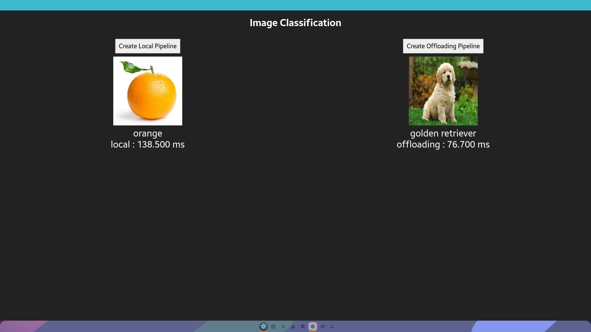

# Image Classification Sample App (Offloading version)
## Description
* This is a sample application of Tizen ML Web APIs.
* If you want to run it on your device, Tizen 8.0 or higher is required.
* `appsrc` and `tensor_query_client` element are used.
* You need to connect `tensor_query_server` to the same Wi-Fi network or ethernet.
* Sample server application is [here](https://github.com/nnstreamer/nnstreamer-android/tree/main/ml_inference_offloading).
* Here's a [guide](https://github.com/nnstreamer/nnstreamer-android/blob/main/documentation/getting_started.md#building-the-tizen-web-app) on how to build.

## Demo

