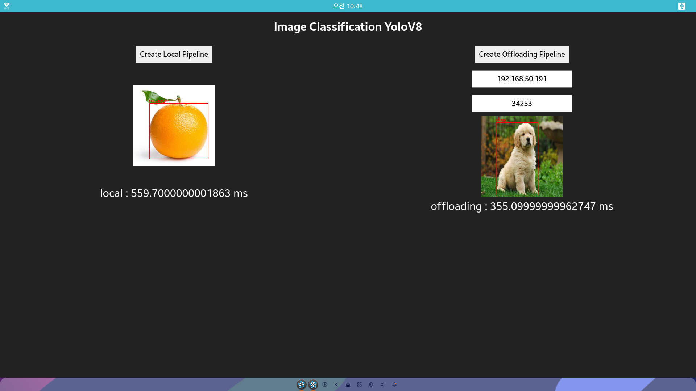

# Image Classification Sample App (Offloading version)
## Description
* This is a sample application of Tizen ML Web APIs.
* If you want to run it on your device, Tizen 8.0 or higher is required.
* `appsrc` and `tensor_query_client` element are used.
* Tflite model is created by this [guide](https://github.com/nnstreamer/nnstreamer-example/tree/main/bash_script/example_yolo#export-to-tflite-and-torchscript-model-1). You should put exported model `yolov8s_float32.tflite` in res directory.
```py
from ultralytics import YOLO

# Load a model
model = YOLO("yolov8s.pt") # load a pretrained model

# Export the model
model.export(format="tflite", imgsz=224) # export the model to tflite format
```

## Demo

