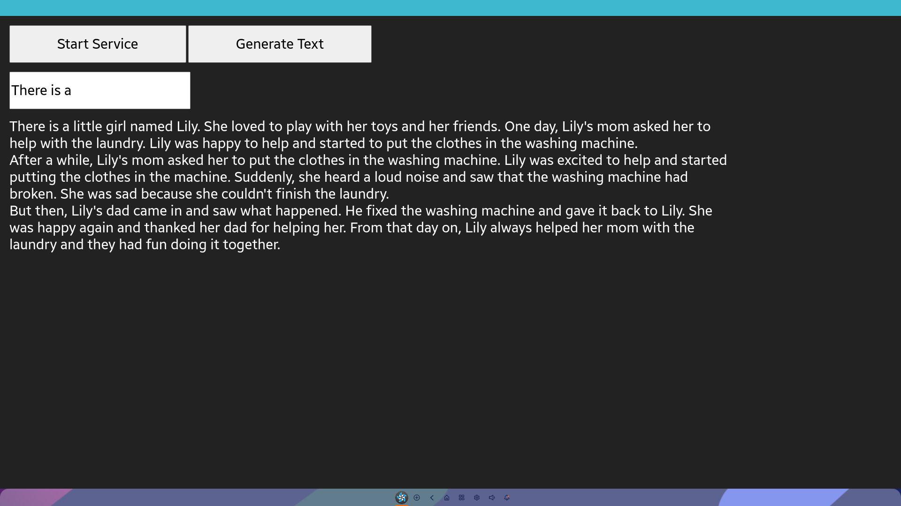

# Text Generation Sample App
## Description
* This is a sample application of Tizen ML offloading.
* If you want to run it on your device, Tizen 8.0 or higher is required.
* `appsrc` and `tensor_query_client` element are used.

## How to build and run
```sh
$ tizen build-web -- WebApplication
$ tizen package -t wgt -- WebApplication/.buildResult/
$ tizen build-native -a arm -c llvm -C Debug -- NsdService/
$ tizen package -t tpk  -- NsdService/Debug/
$ tizen package -t wgt -r NsdService/Debug/lfebC6UrMY.nsdservice-1.0.0-arm.tpk   -- WebApplication/.buildResult/Llama2.wgt
$ tizen install -n WebApplication/.buildResult/Llama2.wgt -t rpi4
$ tizen run -p lfebC6UrMY -t rpi4
```

## Demo

