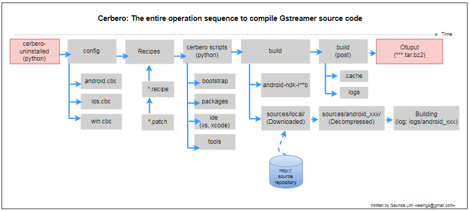

# Android GUI NNStreamer Application Examples

In order to deploy NNstreamer on Android devices, you have to execute four steps as following:
 * Build Android full source
 * Build Gstreamer full source based Android rootFS with Cerbero
 * Build NNstreamer full source with ndk-build
 * Build NNstreamer-based test applications

We assume that you want to deploy a NNstreamer-based application on you own Android/ARM64bit target device.
 * Host PC: Ubuntu 18.04 x86_64 LTS
 * CPU Architecture: ARM 64bit (aarch64)
 * Android platform: 7.0 (Nougat)
 * Android NDK: r12b
 * Android API level: 24

## Build Android full source
We describe how to build Android full source in case that developers have to bring up NNstreamer
on Android 7.0 (Nougat) on Ubuntu 18.04 x86_64 destkop PC.

For more details, please refer to the below websites.
 * https://source.android.com/setup/build/building
 * https://android.googlesource.com


Install required packages
```bash
sudo apt install adb repo
sudo apt-get update
sudo apt-get install openjdk-8-jdk
sudo update-alternatives --config java
sudo update-alternatives --config javac
```

Download Android full source with 'repo' command.
```bash
mkdir WORKING_DIRECTORY
cd WORKING_DIRECTORY
repo init -u https://android.googlesource.com/platform/manifest -b android-7.0.0_r35   
time repo sync -j$(nproc)
```

Compile Android full source. From our experience, you need to wait for 60 minutes to compile all source codes.
```bash
make clobber
source build/envsetup.sh
lunch
time make -j$(nproc)
ls -al ./out/
```


## Build Gstreamer full source based Android rootFS with Cerbero
First of all, you need to understand the entire operation flow of Cerbero enough before making a custom
gst-android binary for yourself as the below picture is shown to you. You can cross-compile GStreamer
for Android software platform from a Linux host using the configuration file 'config/cross-android.cbc'.


```bash
git clone https://gitlab.freedesktop.org/gstreamer/cerbero
cd cerbero
time ./cerbero-uninstalled  -c config/cross-android-arm64.cbc wipe
time ./cerbero-uninstalled -c config/cross-android-arm64.cbc bootstrap
time ./cerbero-uninstalled -c config/cross-android-arm64.cbc package gstreamer-1.0
ls -al *.tar.bz2
```

For more details, please refer to the below websites.
 * https://gitlab.freedesktop.org/gstreamer/cerbero
 * https://github.com/centricular/cerbero-docs/blob/master/start.md

## Build NNstreamer full source with ndk-build
We recommend that you read an Android NDK manual at https://developer.android.com/studio/build/building-cmdline.
If you have to compile just C/C++ source code for Android platform, please use 'ndk-build' command.
Note that You must use 'gradlew' command on the Ubuntu terminal, if you have to compile JNI-based Java source code
as well as C/C++ JNI source code.  The 'ndk-build' command uses jni/Android.mk by default.
However, the 'gradlew' command uses the 'build.gradle' file instead of the existing 'jni/Android.mk'.

```bash
git clone https://github.com/nnsuite/nnstreamer.git
cd ./nnstreamer/jni
ndk-build NDK_PROJECT_PATH=.  APP_BUILD_SCRIPT=./Android-nnstreamer.mk NDK_APPLICATION_MK=./Application.mk -j$(nproc)
```

For more details, please refer to https://github.com/nnsuite/nnstreamer/tree/master/jni.


## Build NNstreamer-based test applications
In order to understand how developers implement a NNstreamer-based application,
You can build simple test applications that is located in ./tests/ directory of the NNstreamer repository as following:

```bash
git clone https://github.com/nnsuite/nnstreamer.git
cd ./nnstreamer/jni
ndk-build NDK_PROJECT_PATH=.  APP_BUILD_SCRIPT=./Android-app.mk NDK_APPLICATION_MK=./Application.mk -j$(nproc)
ls -al ../libs/arm64-v8a/
```

For more details on test applications, please refer to https://github.com/nnsuite/nnstreamer/tree/master/tests

## Experimental: Using patchelf to manipulate ELF files
**Do NOT strip. It may corrupt 'patchelf'.**

We sometimes meet a situation that have to manipulate the existing ELF binary files on the target device
because some software vendors provide binary files only to protect their intellectual property.
In this case, the '[patchelf](https://github.com/NixOS/patchelf)' package is helpful to us to modify
the dynamic linker (ELF interpreter) and RPATH of ELF executables and libraries as an workaround.
 * Change the dynamic loader ("ELF interpreter") of executables
 * Change the RPATH of executables and libraries
 * Remove declared dependencies on dynamic libraries (DT_NEEDED entries)

If you use another distribution instead of Ubuntu, please visit https://pkgs.org/download/patchelf.

```bash
sudo apt install patchelf
man patchelf
```

