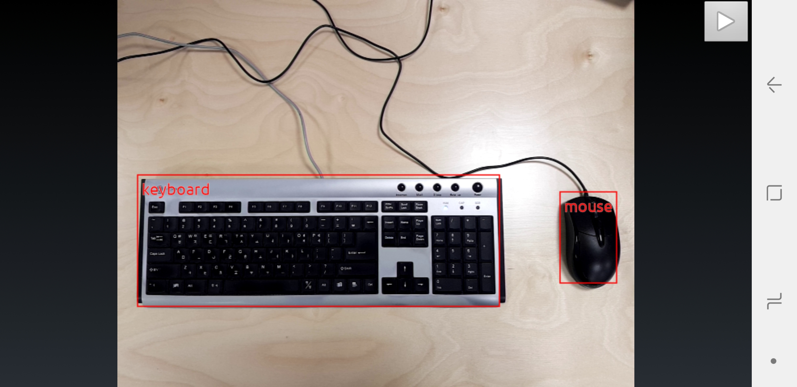
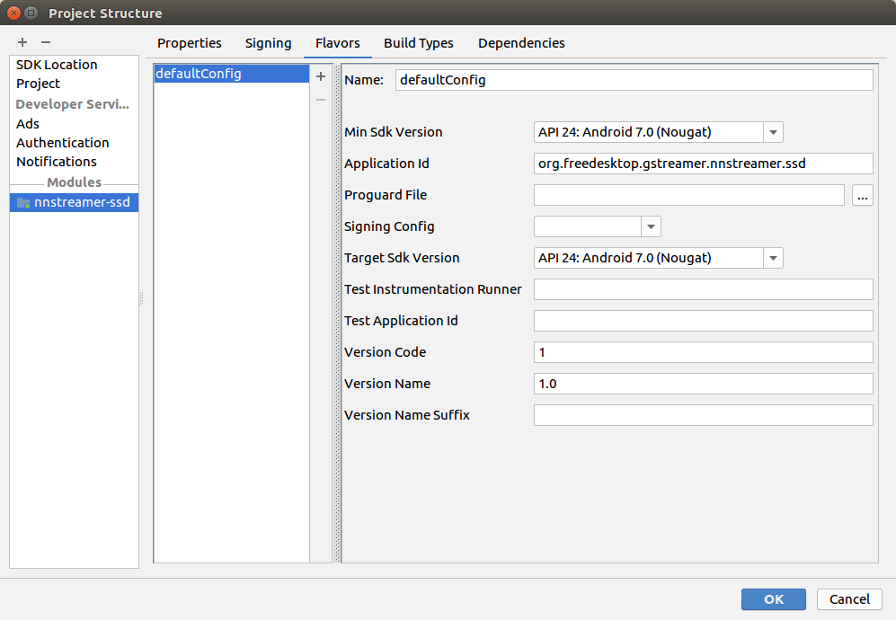
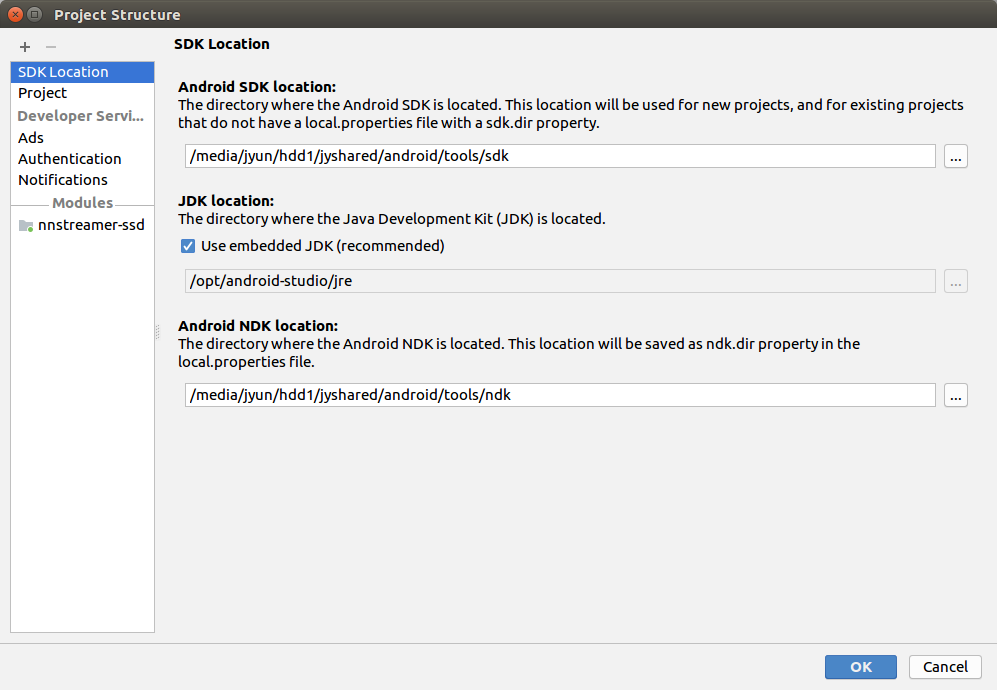
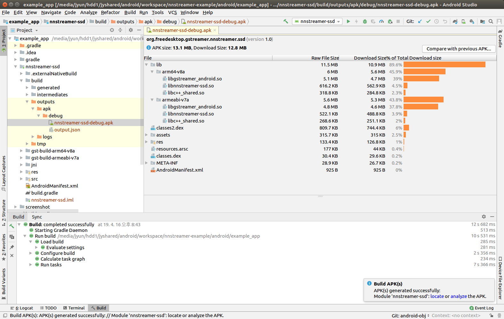

# Android GUI NNStreamer Application Examples

## Prerequisite

We assume that you want to deploy a NNStreamer-based application on your own Android/ARM64bit target device.
Also, we assume that you already have experienced Android application developments with Android Studio.

 * Host PC:
   * OS: Ubuntu 16.04 / 18.04 x86_64 LTS
   * Android Studio: Ubuntu version (However, the Window version will be compatible.)
 * Target Device:
   * CPU Architecture: ARM 64bit (aarch64)
   * Android SDK: Min version 24 (Nougat)
   * Android NDK: Use default ndk-bundle in Android Studio
   * GStreamer: gstreamer-1.0-android-universal-1.16.0

## Build example

We provide various Android examples such as nnstreamer-ssd, nnstreamer-multi, capi-sample and so on. In this guide, we are going to build `NNStreamer-SSD`, which is simple object detection example with TF-Lite model. We built an example using GStreamer tutorials and camera2 source for Android.
- [GStreamer tutorials](https://gitlab.freedesktop.org/gstreamer/gst-docs/)
- [Camera2 source for Android](https://justinjoy9to5.blogspot.com/2017/10/gstreamer-camera-2-source-for-android.html)



#### Setup Android Studio

To build a NNStreamer-based application, you should download Android Studio and setup environment variables for NNStreamer. Please see the details [here](https://github.com/nnstreamer/nnstreamer/blob/master/api/android/README.md).

#### Download NNStreamer Example source code

```bash
$ cd $ANDROID_DEV_ROOT/workspace
$ git clone https://github.com/nnstreamer/nnstreamer-example.git
```

Extract external libraries into common directory.

* [extfiles.tar.xz](common/jni/extfiles.tar.xz) includes external library such as 'ahc'.

* [tensorflow-lite-1.13.1.tar.xz](https://raw.githubusercontent.com/nnstreamer/nnstreamer-android-resource/master/external/tensorflow-lite-1.13.1.tar.xz) includes the libraries and header files of tensorflow-lite.

```
$ cd $ANDROID_DEV_ROOT/workspace/nnstreamer-example/android/example_app/common/jni
$ tar xJf ./extfiles.tar.xz
$ curl -O https://raw.githubusercontent.com/nnstreamer/nnstreamer-android-resource/master/external/tensorflow-lite-1.13.1.tar.xz
$ tar xJf ./tensorflow-lite-1.13.1.tar.xz # Check tensorflow-lite version and extract prebuilt library
$ ls ahc tensorflow-lite
```

#### Install built NNStreamer `aar` file

To build example application, you should install pre-built NNStreamer Android Archive package(e.g. nnstreamer-[DATE].arr) into `android/example_app/api-sample/libs` folder as below. To build this, please refer [this guide](https://github.com/nnstreamer/nnstreamer/tree/master/api/android).


```bash
$ cd $NNSTREAMER_ROOT/android_lib
$ cp nnstreamer-[DATE].aar $ANDROID_DEV_ROOT/workspace/nnstreamer-example/android/example_app/api-sample/libs
```

#### Build `capi-sample` application

Please see [this guide](./capi-sample/README.md)

#### Build the source code with Android Studio

Run Android Studio.

```bash
# If Android Studio was installed under the directory '/opt'
$ /opt/android-studio/bin/studio.sh
```

Import project in Android Studio.


Check a target SDK version (File - Project Structure)



Change a default directory of SDK.
- Change SDK directory (File - Settings - Appearance & Behavior - System Settings - Android SDK - SDK Tools)
  - ```$ANDROID_DEV_ROOT/tools/sdk```



Build project.



#### Install and Run NNStreamer App

You can install your _NNStreamer App_ on your Android device using Android Studio or __adb__ command as below.
```bash
$ cd $ANDROID_DEV_ROOT/workspace/nnstreamer-example/android/example_app/nnstreamer-ssd
$ cd build/outputs/apk/debug         # Build as debug mode
$ adb install nnstreamer-ssd-debug.apk
```

When first launching `NNStreamer App` on your Android device, Application automatically downloads a SSD model and label file into your target device.

If your device does not access the Internet, you can download these files from [Our model repository](http://nnsuite.mooo.com/warehouse/nnmodels/) on your PC and put them in the internal storage of your Android target device as below.

```
{INTERNAL_STORAGE}/nnstreamer/tflite_model/box_priors.txt
{INTERNAL_STORAGE}/nnstreamer/tflite_model/coco_labels_list.txt
{INTERNAL_STORAGE}/nnstreamer/tflite_model/ssd_mobilenet_v2_coco.tflite
...
```

## Terminology
* AHC: Android Hardware Camera2
* JNI: Java Native Interface
* SSD: Single Shot MultiBox Detector
* ABI: Application Binary Interface
* API: Application Programming Interface
* Cairo: A 2D graphics library with support for multiple output device
