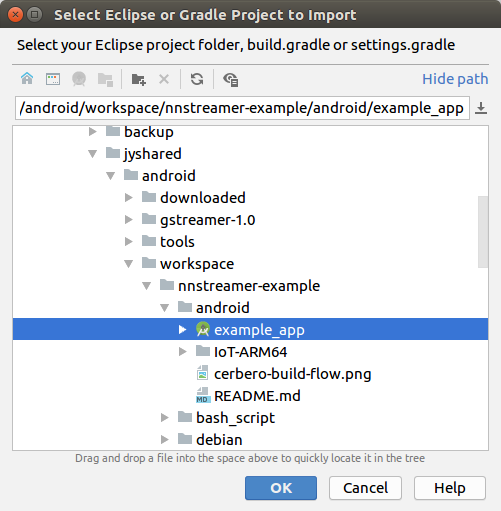

# Android GUI NNStreamer Application Examples

## Prerequisite

We assume that you want to deploy a NNStreamer-based application on your own Android/ARM64bit target device.
 * Host PC: Ubuntu 16.04 x86_64 LTS
 * CPU Architecture: ARM 64bit (aarch64)
 * Android Platform: 7.0 (Nougat)
 * Android NDK: r15c
 * Android API level: 24
 * Android Studio: Ubuntu version (However, the Window version will be compatible.)

## Build example

NNStreamer-SSD: Simple object detection example with TF-Lite model

We built a example using GStreamer tutorials and camera2 source for Android.
- [GStreamer tutorials](https://gitlab.freedesktop.org/gstreamer/gst-docs/)
- [Camera2 source for Android](https://justinjoy9to5.blogspot.com/2017/10/gstreamer-camera-2-source-for-android.html)


#### Install Android Studio

Download and install Android Studio. You can see the installation guide [here](https://developer.android.com/studio/install).

#### Download NDK (Revision 15c)

You can download older version from [here](https://developer.android.com/ndk/downloads/older_releases.html).

Select ```Android NDK, Revision 15c``` and download zip file.

#### Download GStreamer binaries

You can get the prebuilt GStreamer binaries from [here](https://gstreamer.freedesktop.org/data/pkg/android/).

#### Extract downloaded files and configure a development environment

Set your own environment for NNStreamer and Android example.

```
$ANDROID_DEV_ROOT
            /gstreamer-1.0            # gstreamer binaries
            /tools
                /ndk                  # android ndk root directory
                /sdk                  # android sdk root directory
            /workspace
                /nnstreamer           # nnstreamer cloned repository
                /nnstreamer-example   # nnstreamer-example cloned repository
```

```bash
$ export JAVA_HOME=/opt/android-studio/jre            # JRE in Android Studio
$ export ANDROID_DEV_ROOT=$HOME/android               # Set your own path
$ export ANDROID_SDK=$ANDROID_DEV_ROOT/tools/sdk
$ export ANDROID_NDK=$ANDROID_DEV_ROOT/tools/ndk      # Android NDK (Revision 15c)
$ export GSTREAMER_ROOT_ANDROID=$ANDROID_DEV_ROOT/gstreamer-1.0
$ export PATH=$PATH:$ANDROID_NDK:$ANDROID_SDK/platform-tools:$JAVA_HOME/bin
$ export NNSTREAMER_ROOT=$ANDROID_DEV_ROOT/workspace/nnstreamer
```

Download NNStreamer and example.

```bash
$ cd $ANDROID_DEV_ROOT/workspace
$ git clone https://github.com/nnsuite/nnstreamer.git
$ git clone https://github.com/nnsuite/nnstreamer-example.git
```

Extract external libraries in jni directory.

[extlibs.tar.xz](nnstreamer-ssd/jni/extlibs.tar.xz) includes two directories, the libraries and headers to run the pipeline with ahc and tensorflow-lite.

```
$ANDROID_DEV_ROOT
            /workspace
                /nnstreamer-example
                            /android/example_app/nnstreamer-ssd/jni
                                                                   /ahc
                                                                   /tensorflow-lite
```

To prevent build error in GStreamer link command, remove ```-nostdlib++``` in gstreamer-1.0.mk.

```
# Open file $GSTREAMER_ROOT_ANDROID/<target-arch>/share/gst-android/ndk-build/gstreamer-1.0.mk
# Remove argument '-nostdlib++' in GSTREAMER_ANDROID_CMD

GSTREAMER_ANDROID_CMD := $(call libtool-link,$(TARGET_CXX) $(GLOBAL_LDFLAGS) $(TARGET_LDFLAGS) -shared ...
```

#### Copy SSD (Single Shot MultiBox Detector) model and labels into your target device

Make directory and copy SSD model and label files into the internal storage of target device.

You can download these files from [nnsuite testcases repository](https://github.com/nnsuite/testcases/tree/master/DeepLearningModels/tensorflow-lite/ssd_mobilenet_v2_coco).

```
[Internal storage of your target device]
    /nnstreamer
             /tflite_ssd
                       /box_priors.txt
                       /coco_labels_list.txt
                       /ssd_mobilenet_v2_coco.tflite
```

#### Start Android Studio and import a Android project

Run Android Studio. Move to the installed directory and execute ```bin/studio.sh```.

```bash
# If Android Studio was installed under the directory '/opt'
$ /opt/android-studio/bin/studio.sh
```

Import project



Check target SDK version (File - Project Structure)


Change NDK version
- Add NDK (File - Settings - Appearance & Behavior - System Settings - Android SDK - SDK Tools)
- Change NDK directory to ```$ANDROID_DEV_ROOT/tools/ndk``` (File - Project Structure - SDK Location)


Build project


## Terminology
* AHC: Android Hardware Camera2
* JNI: Java Native Interface
* SSD: Single Shot MultiBox Detector
* ABI: Application Binary Interface
* API: Application Programming Interface
* Cairo: A 2D graphics library with support for multiple output device
