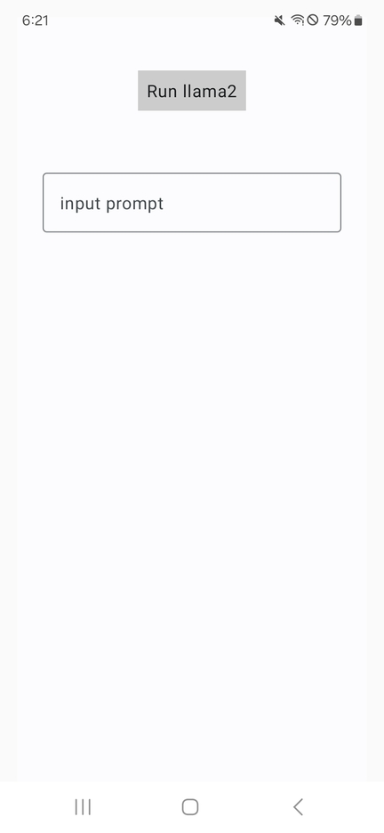
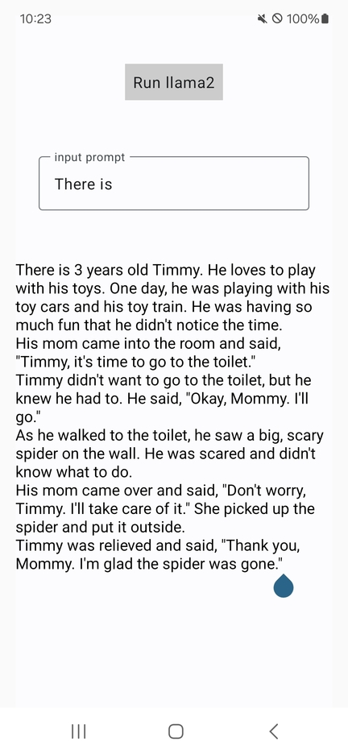

# Android Application Examples using MLOps Solution

## Prerequisite

We assume that you already have experienced Android application developments with Android Studio.

 * Host PC:
   * OS: Ubuntu 20.04 / 22.04 x86_64 LTS
   * Android Studio: Ubuntu version
 * Target Device:
   * CPU Architecture: ARM 64bit (aarch64)
   * Android SDK: Min version 34
   * [nnstreamer-android application](https://github.com/nnstreamer/nnstreamer-android/blob/main/documentation/getting_started.md#building-the-android-app-with-llama2) is installed.

## Build example

We provide a Kotlin example that runs an LLM task.

#### Cloning the GitHub Repository

To build the example application, you need to clone the repository.

```bash
$ git clone https://github.com/nnstreamer/nnstreamer-example

$ ls nnstreamer-example/android/kotlin_app/llama2/
app  build.gradle.kts  gradle  gradle.properties  gradlew  gradlew.bat  local.properties  settings.gradle.kts
$ cd nnstreamer-example/android/kotlin_app/llama2
```

#### Building the Android App using Gradle

In the example application's directory, `Gradle Wrapper` files have already been generated. You can
build apk file as follows.

```bash
$ ./gradlew build

> Task :app:compileReleaseKotlin
...omitted...

$ find app -name "*.apk"
app/build/outputs/apk/debug/app-debug.apk
app/build/outputs/apk/release/app-release-unsigned.apk
```

##### Running the App on the Android Device

The Android device can use `adb` to install and run the app.

```bash
$ cd ${HOME}/Android/Sdk/platform-tools
$ ls adb
adb

$ ./adb devices
List of devices attached
R3CW90D8TNR	device

$ ./adb install ${HOME}/nnstreamer-example/android/kotlin_app/llama2/app/build/outputs/apk/debug/app-debug.apk
Success

$ ./adb shell am start ai.nnstreamer.example.llama2/ai.nnstreamer.example.llama2.MainActivity
Starting: Intent { act=android.intent.action.MAIN cat=[android.intent.category.LAUNCHER] cmp=ai.nnstreamer.example.llama2/.MainActivity }
```

If you can see the same user interface as the following screenshot, the Android app has been
successfully installed and launched on the device.



If you enter the first part of the sentence in the input prompt and press the button, the llama2 model will complete the latter part.


