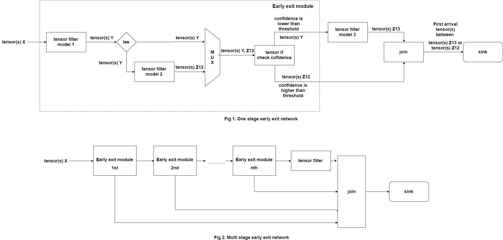

# NNStreamer Native Sample Application - Early exit network
## Introduction
As networks become more larger and larger, this is limited in real-time processing and low power devices.  
In order to alleviate these problems, If confidence reaches a certain level, just use the results without processing the data anymore.  
The concept of pipeline to implement this is as follows:  
  
As depicted in Fig. 1, the simplest early exit network is configured.  
Model 1 performs inference and model 2 evaluates the result of the model 1. Tensor_if determines whether to exit the network or proceed to the next path according to the confidence.  
If confidence is high, exit the network immediately and if it is low, proceed to the next early exit module. As shown in Figure 2, multiple early exit modules can be connected.  
When the network ends early or reaches the end of the network, a join element connects recently arrived buffer from N input streams to one output pad.  

## prerequisite
To obtain the model file used in the example, you must build NNStreamer.  
How to build NNStreamer?: [link](https://github.com/nnstreamer/nnstreamer/wiki/usage-examples-screenshots#build-examples-ubuntu-1604)  
When you build NNStreamer, you should change build options.  
```
$ vi nnstreamer.git/meson_option.txt
$ git diff

diff --git a/meson_options.txt b/meson_options.txt
index 73239b3..2969baf 100644
--- a/meson_options.txt
+++ b/meson_options.txt
@@ -21,7 +21,7 @@ option('grpc-support', type: 'feature', value: 'auto')

 # booleans & other options
 option('enable-test', type: 'boolean', value: true)
-option('install-test', type: 'boolean', value: false)
+option('install-test', type: 'boolean', value: true)
 option('enable-pytorch-use-gpu', type: 'boolean', value: false) # default value, can be specified at run time
 option('enable-mediapipe', type: 'boolean', value: false)
 option('enable-env-var', type: 'boolean', value: true)

```
If you have successfully completed the build nnstreamer, you can find model files here:  
`$ cd $NNST_ROOT/lib/nnstreamer/customfilters`  

If you have successfully completed the build nnstreamer-example, you can find examples here:  
```
$ cd $NNST_ROOT/bin
$ ./gst-launch-early-exit-normal.sh
$ ./gst-launch-early-exit-demo.sh
```

### gst-launch-early-exit-normal.sh
This example is not the actual eraly exit network, but it shows how to construct pipeline.  
You can change the input/output and model used in the example to the appropriate framework and model.  

### gst-launch-early-exit-demo.sh
`gst-launch-early-exit-normal.sh` is difficult to check its operation.  
This example is easy for the user to understand by adding labels according to the path.  
If the brightness of the camera is bright, exit the network, and if it is dark, proceed to the next path (In this case, no further steps).  
