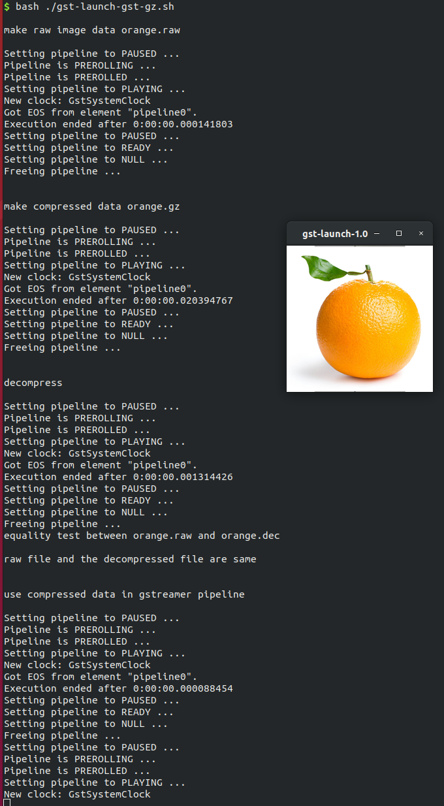

---
title: gst-gz
...

## NNStreamer Native Sample Application - using gst-gz
### Introduction

This example shows how to use gstreamer elements `gzenc` for compressing, and `gzdec` for decompressing data in pipeline.
Those elements are from https://github.com/Snec/gst-gz.

### Getting Started - Download and Install nnstreamer

Please refer [here](../../README.md#use-ppa) to install `nnstreamer` via ppa.

### Getting Started - Build and Install gst-gz

Install dependencies:

```bash
# Basic build tools:
$ sudo apt install git build-essential automake libtool itstool gtk-doc-tools yelp-tools gnome-common gnome-doc-utils yasm flex bison

# Zlib:
$ sudo apt install zlib1g-dev
```

Clone, Build and install:

```bash
$ git clone https://github.com/Snec/gst-gz.git
$ cd gst-gz
$ ./autogen.sh
$ ./configure --with-gstreamer-api=1.0
$ make
$ sudo make install

# The build result `libgstgz.so` was installed in /usr/local/lib/gstreamer-1.0/
$ ls /usr/local/lib/gstreamer-1.0/
libgstgz.a  libgstgz.la*  libgstgz.so*
```

Please refer https://github.com/Snec/gst-gz#getting-started for more details.

### How to run

```bash
# Before running this example, GST_PLUGIN_PATH should be updated for gst-gz plug-in.
$ export GST_PLUGIN_PATH=$GST_PLUGIN_PATH:/usr/local/lib/gstreamer-1.0
$ bash ./gst-launch-gst-gz.sh
```

### Result

You can see the log of series of gstreamer pipelines:



The last pipeline keeps showing the image of orange which is compressed and decompressed by `gst-gz`.

And you can also check the compressed data `orange.gz` created by this example has smaller size than original `orange.png` file:

```bash
$ ls -l orange*
-rw----r-- 1 yongjoo yongjoo 150528 Sep  6 15:10 orange.dec
-rw----r-- 1 yongjoo yongjoo  66854 Sep  6 15:10 orange.gz
-rw-r--r-- 1 yongjoo yongjoo  74712 Sep  6 14:33 orange.png
-rw----r-- 1 yongjoo yongjoo 150528 Sep  6 15:10 orange.raw
```
