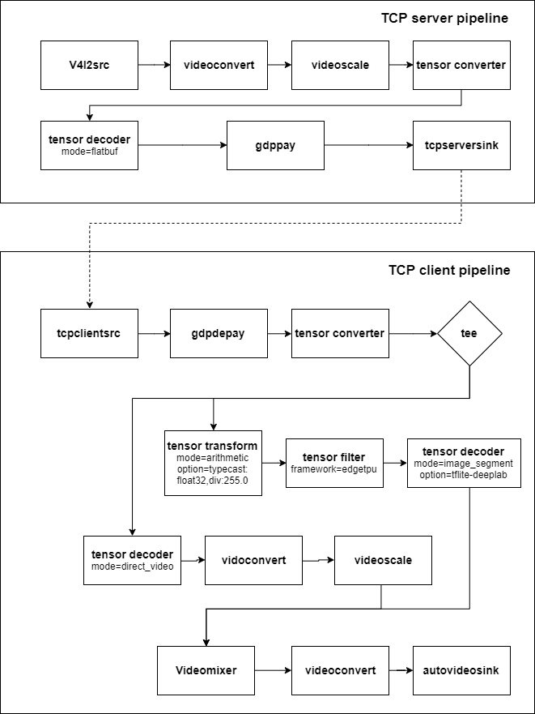

## NNStreamer Edge-AI Apllication - Image Segmentation (edgeTPU)
### Introduction
Image segmentation is the process of partitioning a digital image into multiple segments.
The purpose of this app is show how to send the flatbuf to the edge device and perform inferences on the edgeTPU.
#### Graphical description of the pipeline


### How to run
 * Preparing nnstreamer for execution, refer this [link](https://github.com/nnstreamer/nnstreamer/wiki/usage-examples-screenshots#preparing-nnstreamer-for-execution)
 * Install Prerequisites
   *  Install flatbuffers runtime library
   ```
   $ sudo apt-get update
   $ sudo apt-get install libflatbuffers
   ```
   * Install GStreamer Data Protocol (libgstgdp.so)
     * For tizen device, download `gst-plugins-bad*.rpm` from [here](http://download.tizen.org/releases/daily/tizen/unified/latest/repos/standard/packages/)
     * For ubuntu, `$ sudo apt-get install libgstreamer-plugins-bad1.0-0`
 * Download model files
    ```
    $ cd $NNST_ROOT/bin/
    $ ./get-model.sh image-segmentation-tflite
    ```
