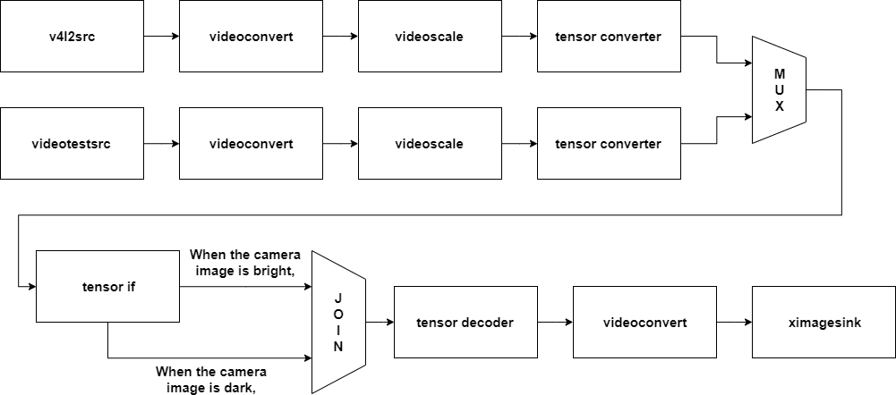

---
title: Join
...

## NNStreamer Native Sample Application - join
### Introduction

Join element connects recently arrived buffer from N input streams to one output pad.  
The purpose of this app is show how to use join element in pipeline.  
If the brightness of the camera is bright, the camera image is output, and if it is dark, the video test source is output.

### Graphical description of pipeline - tensor_if passthrough action

