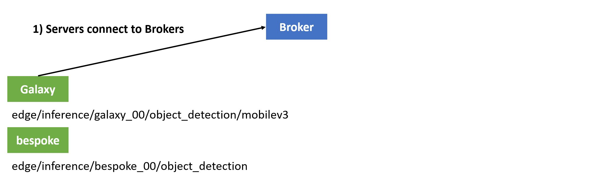
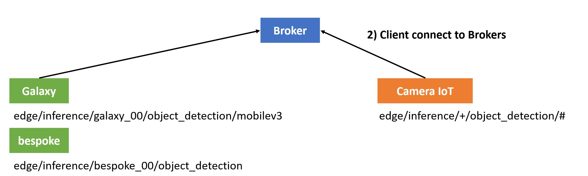
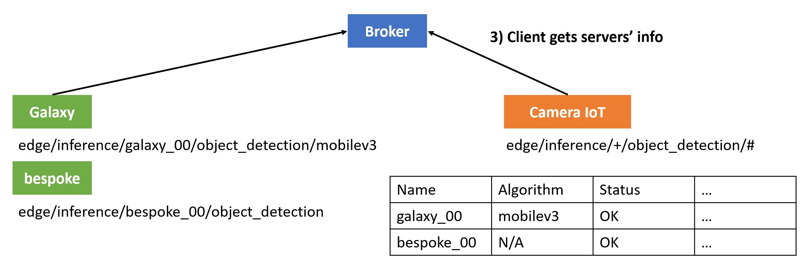
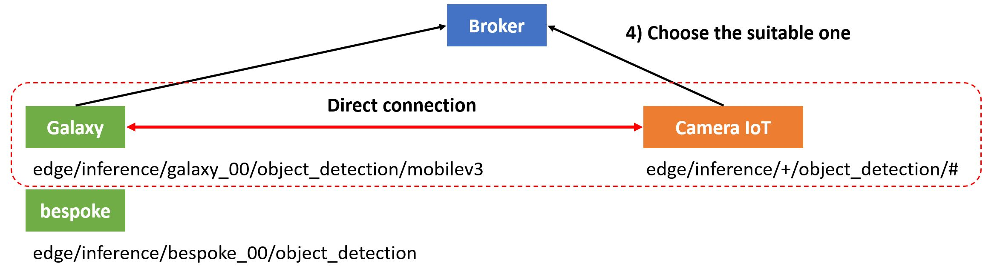
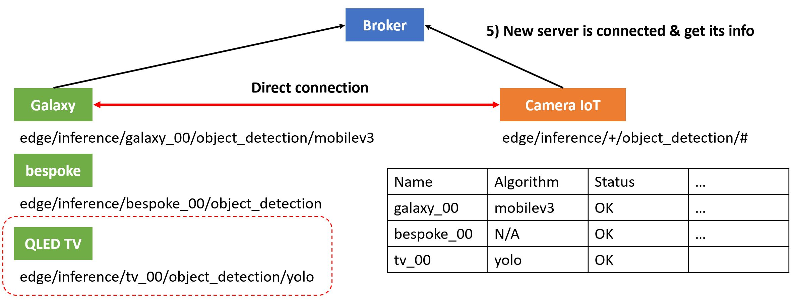
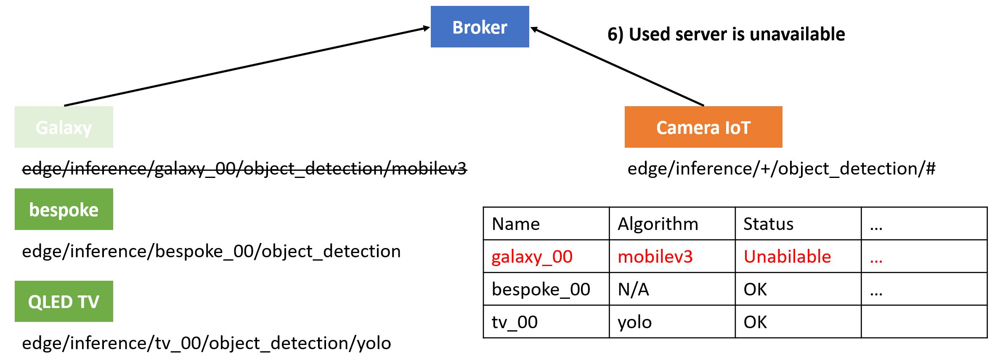
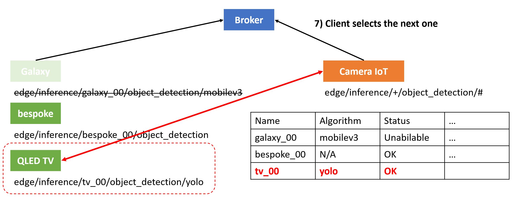
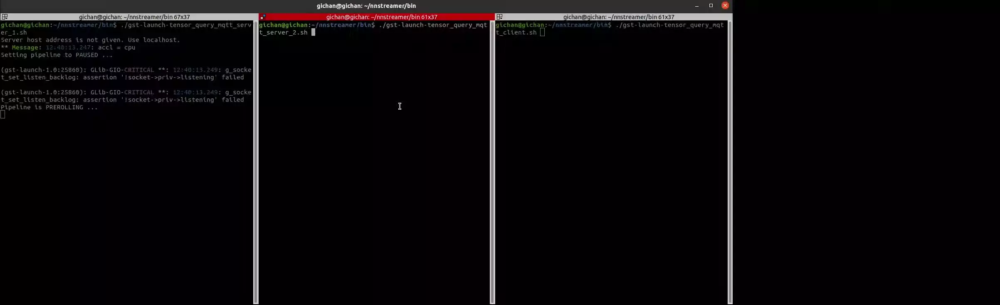

---
title: Tensor Query - MQTT hybrid
...

# NNStreamer Native Sample Application - Tensor query with robustness support
## Introduction
The purpose of this example is to show the robustness of the tensor_query.  
If the server connected to the client is stopped, find an alternative server and connect it to continue streaming.  

## Robustness Scenario
*Note: The pictures are a little different from the example. It's just for your better understanding.  
### 1) Servers connect to Brokers

  - The servers connect to brokers and publish the server information.
    - edge/inference/galaxy_00/object_detection/mobilev3
    - edge/inference/TV_00/object_detection/yolo

### 2) Client connect to Broker

  - The client connect to broker.

### 3) Client gets server's Information

  -  The client subscribes to 'edge/inference/+/object_detection/#' topic.
    - \+ : single level wildcard that matches any name
    - \# : multi level wildcard used at the end of the topic

### 4) Choose the suitable one


### 5) New server is connected & get its info via callback mechanism


### 6) Used server is unavailable


### 7) Choose the next one


## Prerequisite
 - NNStreamer: [link](https://github.com/nnstreamer/nnstreamer/wiki/usage-examples-screenshots)
 - NNStreamer-edge (nnsquery): [link](https://github.com/nnstreamer/nnstreamer-edge/tree/master/src/libsensor)
 - Install mosquitto broker: `$ sudo apt install mosquitto mosquitto-clients`

## Run examples
If you have successfully completed the build nnstreamer-example, you can find examples here:  
```bash
$ cd $NNST_ROOT/bin
$ ./gst-launch-tensor_query_mqtt_server_1.sh
$ ./gst-launch-tensor_query_mqtt_server_2.sh
$ ./gst-launch-tensor_query_mqtt_client.sh
```

This example requires specific tflite model and label data.  
**get-model.sh** download these resources.
```bash
$ cd $NNST_ROOT/bin
$ ./get-model.sh object-detection-tflite
```

## Demo video

### Demo scenario
1) Run the server 1
2) Run the server 2
3) Run the client (The client connected to the server 1)
4) Stop the server 1 (The client connected to the server 2)
5) Stop the client
6) Run the client (The client connected to the server 2)
7) Run the server 1
8) Stop the server 2 (The client connected to the server 1)
