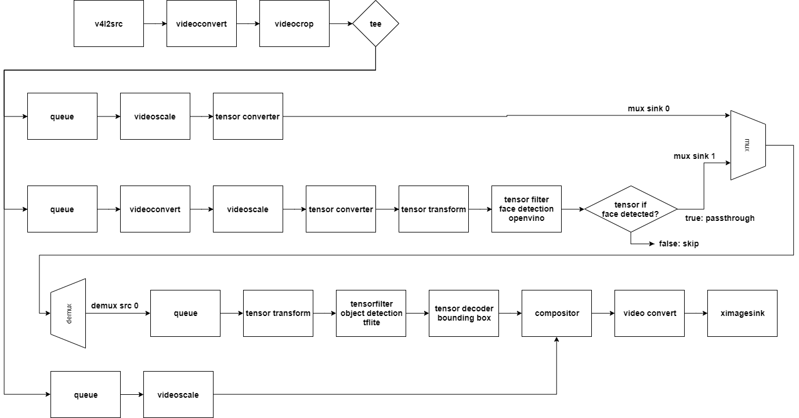
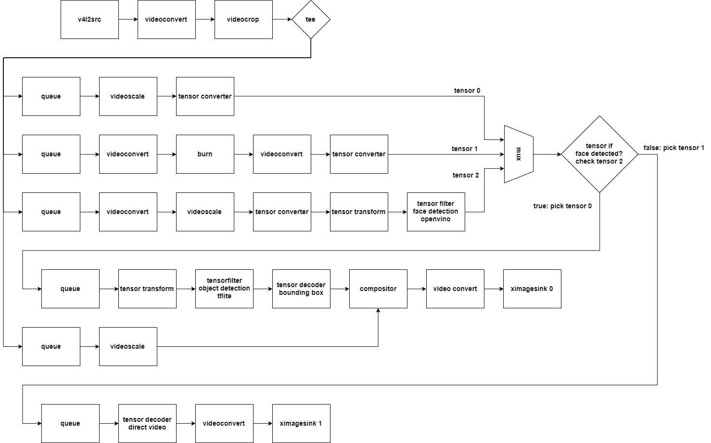

## NNStreamer Native Sample Application - tensor_if
### Introduction

This example passes camera video stream to a neural network using **tensor_filter**. The neural network detects faces of people in input stream.  
The tensor_if element controls the data stream depending on whether the face is detected from the filter.  
If the face is detected, start detecting objects.

### Graphical description of pipeline - tensor_if passthrough action

When the face is detected, the tensor_if operates in passthrough mode.

When the face is detected, the tensor_if operates in tensorpick mode.  
If there is a face, it detects the object, and if there is no face, it adjusts the colors of a video stream.

