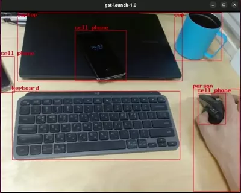

# yolov5, yolov8 object detection example with simple gstreamer pipeline


## 1. Yolov5

### Install ultralytics

```bash
$ pip install ultralytics
```

### Export to different model representations

REF: https://github.com/ultralytics/ultralytics#documentation
```python3
from ultralytics import YOLO

# Load a model
model = YOLO("yolov5su.pt") # load a pretrained model

# Export the model
model.export(format="tflite", imgsz=320) # export the model to tflite format
model.export(format="torchscript", imgsz=320) # export the model to torchscript format
model.export(format="onnx", imgsz=320) # export the model to onnx format

```

Note that setting the input image size as 320px, rather than the default 640px to increase inference speed. You can take other weight options (n, s, m, l, x) and input image size.

### Run the object detection example

```bash
$ ./gst-launch-object-detection-yolov5-tflite.sh
$ ./gst-launch-object-detection-yolov5-torchscript.sh
$ ./gst-launch-object-detection-yolov5-tensorrt.sh
```

## 2. Yolov8

### Install ultralytics

```bash
$ pip install ultralytics
```

### Export to different model representations

REF: https://github.com/ultralytics/ultralytics#documentation
```python3
from ultralytics import YOLO

# Load a model
model = YOLO("yolov8.pt") # load a pretrained model

# Export the model
model.export(format="tflite", imgsz=320) # export the model to tflite format
model.export(format="torchscript", imgsz=320) # export the model to torchscript format

```

Note that setting the input image size as 320px, rather than the default 640px to increase inference speed. You can take other weight options (n, s, m, l, x) and input image size.

### Run the object detection example

```bash
$ ./gst-launch-object-detection-yolov8-tflite.sh
$ ./gst-launch-object-detection-yolov8-torchscript.sh
```

### Screenshot


