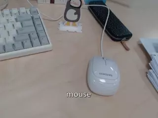

# Ubuntu Native C/C++ NNStreamer Example Applications

+ [Image Classification](./example_image_classification_tflite/README.md)   

+ [Object Detection](./example_object_detection_tensorflow_lite/README.md)   

+ [Pose Estimation](./example_pose_estimation_tflite/README.md)   

