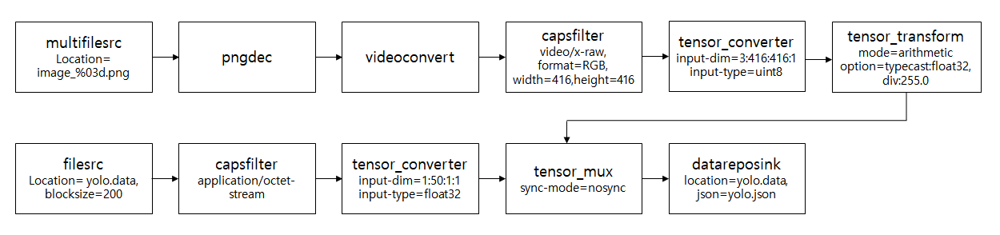
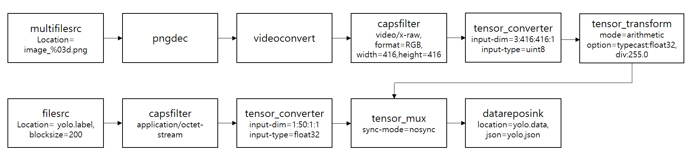

---
title: Data preporcessing for generating training data
...

## Ubuntu Native NNStreamer Application Example - Data preporcessing for generating training data
### Introduction
This example generates tensor data for YOLO model training after data preprocessing, and saves the tensor data and meta-information of Gstreamer-pipeline using **datareposink**. The dataset consist of four resized(416x416) COCO Image files and a text file with annotation information(class, x, y, width and height). this dataset is changed to the feature and label tensor data required for the model and becomes one tensor data using **tensor_mux** with ```sync-mode=nosync``` (https://github.com/nnstreamer/nnstreamer/blob/main/Documentation/synchronization-policies-at-mux-merge.md).



The person using the model needs to know how to construct the model and what data formats are required. The performance of the model is related to the construction of the model and the preprocessed data. depending on the model you are using, the data preprocessing method will be different. this is an example of a model that takes one feature and one label as input. feature uses RGB (3x416x416) and normalized values between 0 and 1 of float32. to use a label file in gstreamer-pipeline, the label data is saved as a binary file in the format required by the model in the **create_label_file()**. labels store the location information of up to 10 objects in one image (filled with zeros if the number of objects is insufficient).

[000000005477.txt] 
```
4 6 126 404 218
4 33 296 162 33
```
The values are Class:4(airplane), X:6, Y:126, W:404 and H:128

[000000005477.png]



Images need to be renamed with placeholders in order to be used in **multifilesrc**.
This example constructs a file list using **g_dir_open()** and renames each file by adding a placeholder to the string entered as the value of **argv[1]**.
```
e.g. rename("000000005477.png", "image_003.png");
```

### How to Run
Extract coco_sample.zip at $NNST_ROOT/bin
run as below.
```
argv[0] : file path
argv[1] : new name for rename
#bash
$ mv coco_sample.zip $NNST_ROOT/bin
$ cd $NNST_ROOT/bin
$ unzip coco_sample.zip
$ export GST_PLUGIN_PATH=$GST_PLUGIN_PATH:$NNST_ROOT/lib/gstreamer-1.0
$ ./nnstreamer_example_data_preprocessing coco_sample image
```
