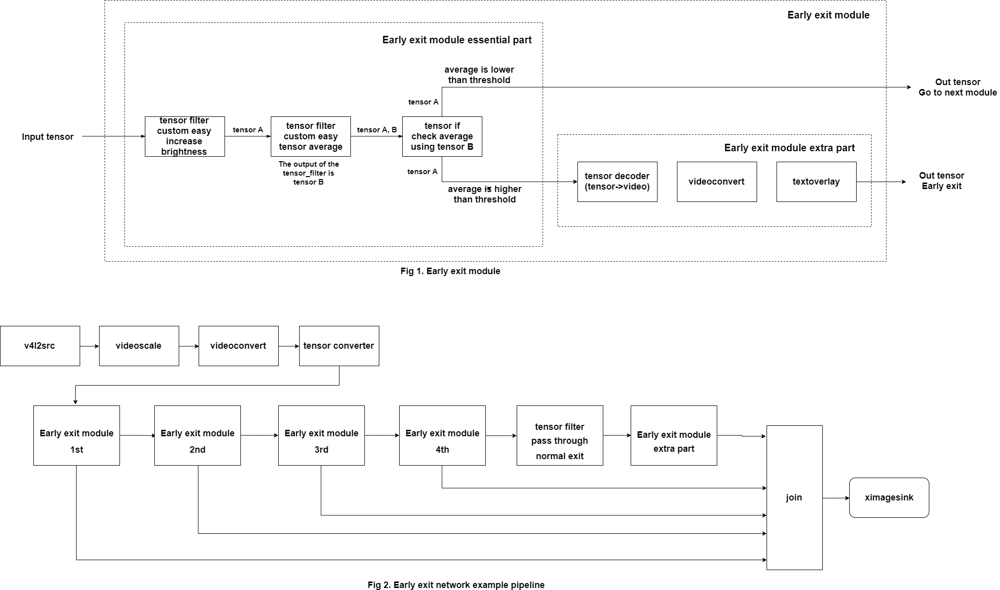

---
title: Early exit
...

# NNStreamer Native Sample Application - Early exit network
## Introduction
As networks become more larger and larger, this is limited in real-time processing and low power devices.  
In order to alleviate these problems, If confidence reaches a certain level, just use the results without processing the data anymore.  
The concept of pipeline to implement this is as follows:  
  

Fig. 1 shows early exit module. The first filter increases the value of tensor (brightness of video).  
The average value is calculated in the path including the filter, and the two tensors are combined again in tensor_mux element.  
Tensor_if element determines whether to exit the network or proceed to the next module by checking average value of the tensor.  
`Early exit module extra part` is not an essential but it is added for demo purposes.  
As depicted in Fig. 2, There are four early exit modules, each module is connected to join element when the condition 'early-exit' is met, and to the next module when it is not.  
Join element connects recently arrived buffer from 5 input streams to ximagesink.  

If you have successfully completed the build nnstreamer-example, you can run example:  
```
$ cd $NNST_ROOT/bin
$ ./nnstreamer_example_early_exit
```
