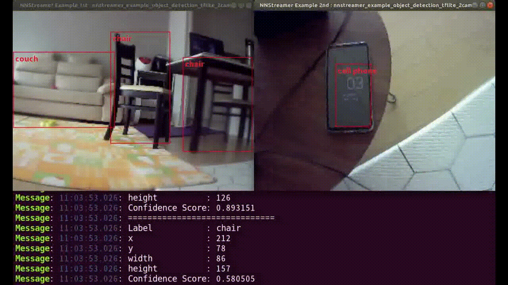
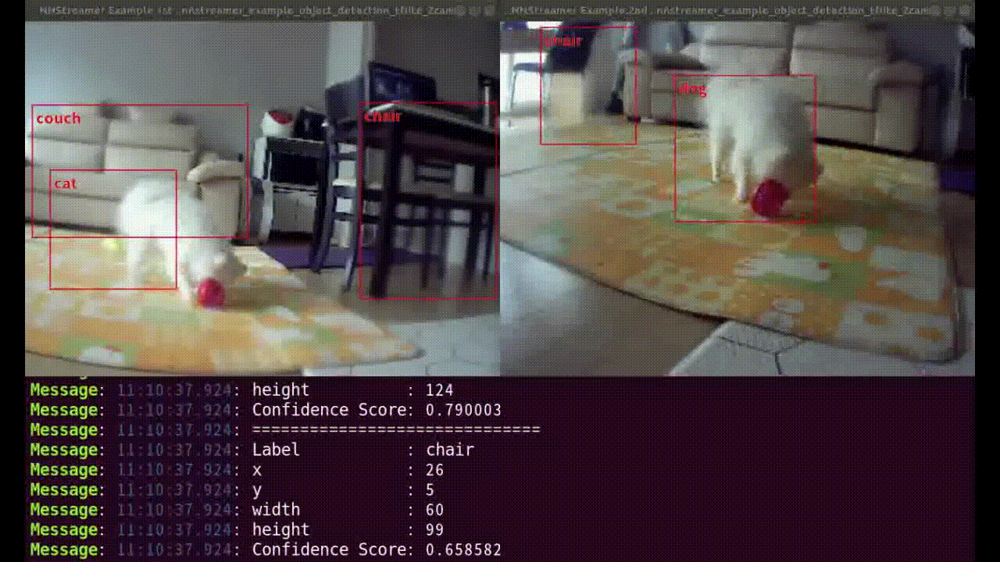

## Object Detection with 2 cameras
This example passes camera video stream to a neural network using **tensor_filter**.
Then the given neural network predicts multiple objects with bounding boxes. The detected boxes are drawen by **cairooveray** GStreamer plugin.

### Sender
Raspberry Pi 4
Ubuntu Server 18.04 arm64
2 USB cameras (720p, 30fps)
It streams videos with 2 cameras to 2 different network ports.
**warning**: the device node for your camera may varing from /dev/video0 to /dev/videoN... so check your dmesg to make sure where is your camera node now.

### Receiver
Ubuntu Desktop 18.04
It gets video streams from 2 network ports and detects objects for each video.
You can see two windows for each video.

### How to Run
This example requires a tflite model, labels, and box priors.
The resources can be obtained from this link: https://github.com/nnsuite/testcases/raw/master/DeepLearningModels/tensorflow-lite/ssd_mobilenet_v2_coco

**get-model.<span>sh** downloads the required model and other txt data files.
```bash
# bash
$ cd $NNST_ROOT/bin
$ ./get-model.sh object-detection-tflite
$ export GST_PLUGIN_PATH=$NNST_ROOT/lib/gstreamer-1.0:${GST_PLUGIN_PATH}
$ ./nnstreamer_example_object_detection_tflite_2cam sender   IP PORT1 /dev/video0 PORT2 /dev/video1
$ ./nnstreamer_example_object_detection_tflite_2cam receiver IP PORT1 PORT2
```

### Demo


