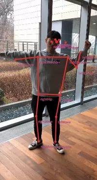

---
title: Pose Estimation
...

## Ubuntu Native NNStreamer Application Example - Pose Estimation (Single Person)
### Introduction
This example passes camera video stream to a neural network using **tensor_filter**.
The neural network predicts positions of 17 body parts of the person in input stream. The results are drawn by **cairooveray** GStreamer plugin.

### How to Run
This example requires pose estimation tf lite model and key point label (for body parts).  
The public model can be obtained from this link: https://storage.googleapis.com/download.tensorflow.org/models/tflite/posenet_mobilenet_v1_100_257x257_multi_kpt_stripped.tflite  
**get-model.<span>sh** download the required model and make label text file
```bash
# bash
$ cd $NNST_ROOT/bin
$ ./get-model.sh pose-estimation-tflite
$ export GST_PLUGIN_PATH=$GST_PLUGIN_PATH:$NNST_ROOT/lib/gstreamer-1.0
$ ./nnstreamer_example_pose_estimation_tflite
```

### Screenshots
  
