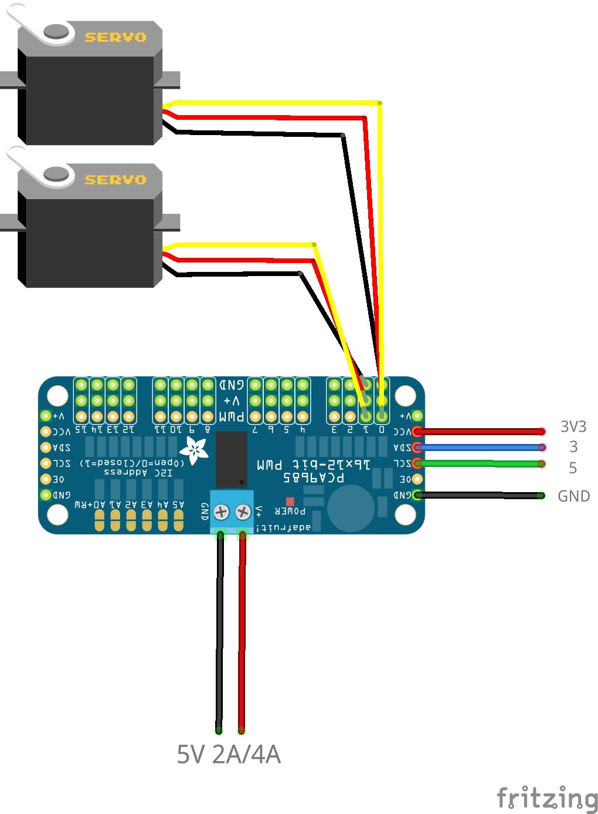

## Ubuntu Native NNStreamer Face Tracking Application with Servo

### Introduction

This example is an application that tracks faces using two servo motors.

NNStreamer is used to detect faces and hands, and a servo motor is used to track faces to continuously track the largest face on the camera.

One example use neural network for face detection to detect face in video and tracking.

Another example use neural network for face and hand detection. In this example, the face and hand can be detected at the same time. If hand is close to your face, “Caution!” is displayed on the screen. In situations where hygiene is important, it is dangerous to touch your face with your hands.

To run this example, you need two servo motors and a motor driver, a 5V 2A/4A AC adapter, and an ARM64-based single board computer supporting Ubuntu operating system.

Also, both example can live streaming to Youtube. Youtube rtmp auth key is required for live streaming.

Detailed requirements are as follows:

```
Supported SBCs (ARM64 based SBC with Ubuntu support)
- Jetson Nano (4GB)
- Jetson Xavier NX

Required Hardware Part
- HS-422 Servo x 2
- PCA9685 Motor Driver (Adafruit/Sunfounder)
- F/F Jumper Cable x 4
- 5V 2A/4A AC adapter for PCA9685
- USB Camera

Required Software
- GStreamer/NNStreamer (Python)
- Adafruit Servokit Driver
```


### How to Run

The hardware configuration for face tracking should be made as follows based on Jetson Nano/Xavier NX.



`Ubuntu 18.04` or higher is required to run NNStreamer on `ARM64-based SBC`. Install the NNStreamer environment with the following commands. 

```
$ sudo add-apt-repository -y ppa:nnstreamer/ppa
$ sudo add-apt-repository -y ppa:nnstreamer-example/ppa
$ sudo apt-get update
$ sudo apt-get -y install git build-essential nnstreamer
$ sudo apt-get -y install ninja-build meson python-pip python3-pip libglib2.0-* python-gi python3-gi python-gst-1.0	python3-gst-1.0 python-gst-1.0-dbg python3-gst-1.0-dbg libgstreamer-gl1.0-0 libgstreamer-opencv1.0-0 libgirepository1.0-dev gir1.2-gstreamer-1.0 python-gst-1.0* libgstreamer-plugins-* libgstreamer-plugins-base1.0-dev libgstreamer1.0* gstreamer1.0-plugins-* libcairo-5c0 libcairo-gobject* libcairo2* tensorflow-* libprotobuf* protobuf-compiler17 libflatbuffers libflatbuffers-dev flatbuffers-compiler libjpeg-dev libgif-dev
$ sudo apt-get -y install nnstreamer-caffe2 nnstreamer-cpp nnstreamer-cpp-dev nnstreamer-edgetpu nnstreamer-python3 nnstreamer-cpp nnstreamer-dev nnstreamer-openvino nnstreamer-python2 nnstreamer-pytorch nnstreamer-util nnstreamer-tensorflow-lite
```


Since the example is based on `GLib`, `GObject`  and `adafruit-circuitpython-servokit`, these packages need to be installed before running. NumPy is also needed.

```
$ sudo apt-get install pkg-config libcairo2-dev gcc python3-dev libgirepository1.0-dev python3-numpy
$ pip3 install gobject PyGObject
$ sudo pip3 install adafruit-circuitpython-servokit	# This library must be installed with sudo privileges.
```

This example requires specific tflite models and label data.

**get-model.sh** download these resources.

```
# bash
$ cd $NNST_ROOT/bin
$ ./get-model.sh face-detection-tflite
$ ./get-model.sh hand-detection-tflite
$ python3 nnstreamer_example_face_detection_servo.py
$ python3 nnstreamer_example_multi_model_servo.py
```

If you have a Youtube rtmp key, Live stream application by add parameter `--rtmp`

```
# Youtube Live Streaming
$ python3 nnstreamer_example_face_detection_servo.py --rtmp <RTMP AUTH KEY>
$ python3 nnstreamer_example_multi_model_servo.py --rtmp <RTMP AUTH KEY>
```
