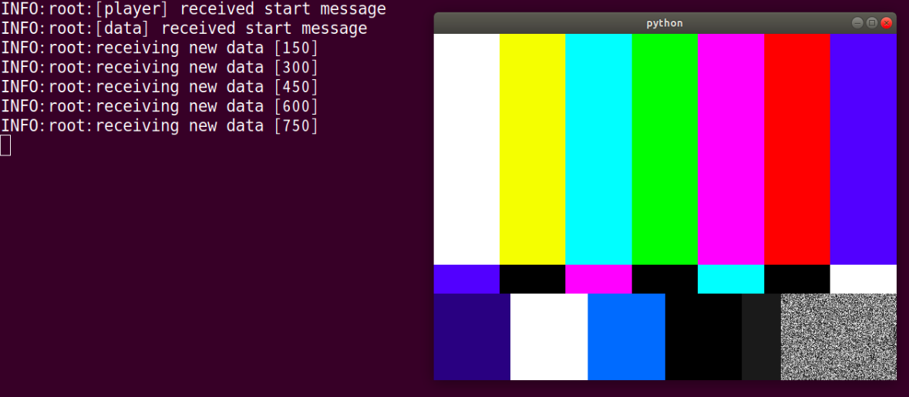

---
title: sink eample
...

## sink_example
This sample example shows how to init tensor sink element and get data.

### How to Run
Before running this example, GST_PLUGIN_PATH should be updated for nnstreamer plug-in.

```bash
$ export GST_PLUGIN_PATH=$GST_PLUGIN_PATH:$NNST_ROOT/lib/gstreamer-1.0
# C
$ ./nnstreamer_sink_example
# Python
# You can test 3 types: video, audio, and text
$ python nnstreamer_sink_example.py video
$ python nnstreamer_sink_example.py audio
$ python nnstreamer_sink_example.py text
```


## sink_example_play
This sample app shows video frame using two pipelines.

### How to Run
Before running this example, GST_PLUGIN_PATH should be updated for nnstreamer plug-in.

```bash
$ export GST_PLUGIN_PATH=$GST_PLUGIN_PATH:$NNST_ROOT/lib/gstreamer-1.0
# C
$ ./nnstreamer_sink_example_play
# Python
$ python nnstreamer_sink_example_play.py
```

### Screenshot

