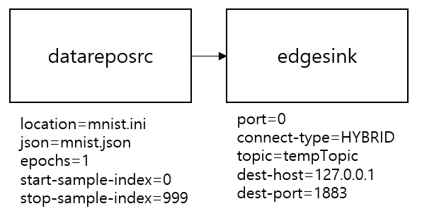
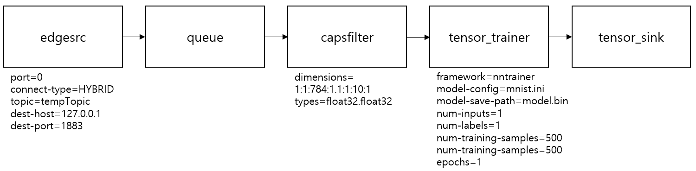

---
title: Training offloading example
...

## Ubuntu Native NNStreamer Application Example - Training offloading
### Introduction
This example implements training offload between two devices in the [nnstreamer-edge](https://github.com/nnstreamer/nnstreamer-edge) network environment. This operates as a sender or a receiver according to the stream-role value input from the user. The sender reads the data required for training from ```datareposrc``` and uses ```edgesink``` to send the data to the peer device on the network. The receiver reads the received data from the peer device using ```edgesrc``` and pushes it to tensor_trainer. Then tensor_trainer trains the model using the data. Data transmission and reception between ```edgesink``` and ```edgesrc``` in the network is carried out through MQTT broker. User does not need to know the details and only needs to match the ```dest-host(IP)```, ```dest-port```, ```connect-type``` and ```topic``` of the MQTT broker to connect ```edgesrc``` and ```edgesink```.

#### sender pipeline ####
The sender is configured as follows. ```datareposrc``` reads data from the location path with ```JSON``` meta information. ```datareposrc``` repeatedly reads the data as many as ```epochs``` from ```start-sample-index``` to ```stop-sample-index``` among the entire data set. The default value of ```epochs``` is 1, the default value of ```start-sample-index``` is 0 and the default value of ```stop-sample-index``` is the total number of samples -1. If you use the default value, you do not need to set the value. ```edgesink``` uses nnstreamer-edge network environment. ```edgesink``` connect to ```MQTT broker``` so it needs to run ```systemctl start mosquitto```. The connection type of ```edgesink``` is ```HYBRID``` and the topic is ```tempTopic```.



#### receiver pipeline ####
The receiver is configured as follows. To receive data from a peer device, ```edgesrc``` uses nnstreamer-edge network environment. As with the sender, ```edgesrc``` connects to MQTT broker so it needs to run ```systemctl start mosquitto```. The connection type of ```edgesink``` is ```HYBRID``` and the topic is ```tempTopic```. Now, the received data is passed to tensor_trainer. Set the ```framework``` to use for training the model, configure the model with ```model-config``` file and set ```model-save-path``` to save a model. For input caps of tensor_trainer, refer to gst_caps in JSON file or check the input format of model-config. Users will know the format of the data used for model training and the number of inputs and labels. The preprocessed data affects the performance of model training. Set ```num-inputs``` and ```num-labels```(both default value is 1). It needs to set how many of the input data being used for training and validation for model training, and set the number of epochs. The properties for these are ```num-training-samples```, ```num-validation-samples```, and ```epochs``` respectively.



### How to Run
Run the mosquitto service and check that the status is Active.
```
#bash
$ sudo systemctl start mosquitto
$ sudo systemctl status mosquitto
```
Sender
```
$ cp ./res/mnist.data $NNST_ROOT/bin
$ cp ./res/mnist.json $NNST_ROOT/bin
$ cd $NNST_ROOT/bin
$ export GST_PLUGIN_PATH=$GST_PLUGIN_PATH:$NNST_ROOT/lib/gstreamer-1.0
$ ./nnstreamer_example_training_offloading --stream-role=sender --filename=mnist.data --json=mnist.json --epochs=1 --start-sample-index=0 --stop-sample-index=999 --dest-host=127.0.0.1 --dest-port=1883
```
receiver
```
$ cp ./res/mnist.ini $NNST_ROOT/bin
$ cd $NNST_ROOT/bin
$ export GST_PLUGIN_PATH=$GST_PLUGIN_PATH:$NNST_ROOT/lib/gstreamer-1.0
$ ./nnstreamer_example_training_offloading --stream-role=receiver --dest-host=127.0.0.1 --dest-port=1883 --framework=nntrainer --model-config=mnist.ini --model-save-path=model.bin --num-training-sample=500 --num-validation-sample=500 --epochs=1 --num-inputs=1 --num-labels=1 --input-caps="other/tensors,format=static,num_tensors=2,framerate=0/1,dimensions=1:1:784:1.1:1:10:1,types=float32.float32"
```
