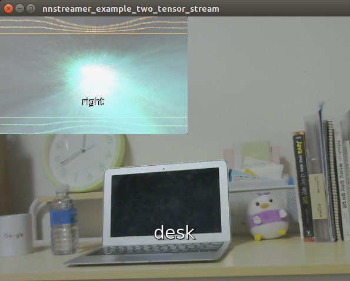

## Native NNStreamer Application Example - Two Tensor Stream
### Introduction
This example passes both camera and audio source to two separate neural network using **tensor_filter**. Image classification and speech command classification results are saved using **tensor_sink**, and they are combined using **compositor** GStreamer plugin. 

### How to Run
This example requires image classification tensorflow lite model, speech command classification tensorflow lite model, and custom tensor_filter shared library built by example_speech_command_tensorflow_lite. 

```bash
# build nnstreamer-example 
# (this should generate libnnscustom_speech_command_tflite.so in NNST_ROOT/bin)
$NNST_ROOT/bin $ bash get-model-image-classification.sh
$NNST_ROOT/bin $ bash get-model-speech-command.sh
$NNST_ROOT/bin $ export GST_PLUGIN_PATH=$GST_PLUGIN_PATH:$NNST_ROOT/lib/gstreamer-1.0
$NNST_ROOT/bin $ ./nnstreamer_example_two_tensor_stream
```

### Screenshot

